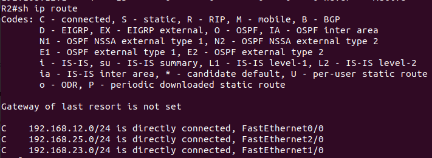
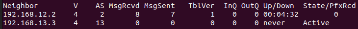
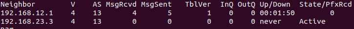
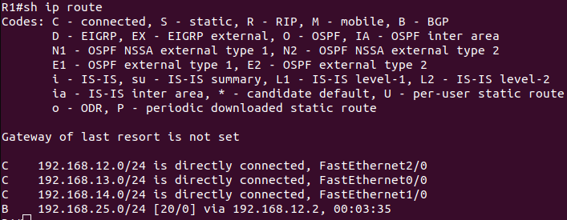
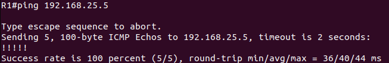

# 
 TP1 R302

## I.Prise en main de BGP
### I.1 Configuration de base : établissement de liens BGP entre voisins

1.
<pre>

R1 : interface 0/0 192.168.13.1/24
     interface 1/0 192.168.14.1/24
     interface 2/0 192.168.12.1/24
     Route : No route
     Routing protocol : No routing protocol
     IP protocol : No ip protocol

R2 : interface 0/0 192.168.12.2/24
     interface 1/0 192.168.23.2/24
     interface 2/0 192.168.25.2/24
     Route : No route
     Routing protocol : No routing protocol
     IP protocol : No ip protocol

R3 : interface 0/0 192.168.13.3/24
     interface 1/0 192.168.23.3/24
     interface 2/0 192.168.36.3/24
     Route : No route
     Routing protocol : No routing protocol
     IP protocol : No ip protocol

R4 : interface 0/0 192.168.14.1/24
     Route : 192.168.14.1
     Routing protocol : No routing protocol

R5 : interface 0/0 192.168.25.5/24
     Route : 192.168.25.2
     Routing protocol : No routing protocol
     IP protocol : No ip protocol

R6 : interface 0/0 192.168.36.6/24
     Route : 192.168.36.3
     Routing protocol : No routing protocol
     IP protocol : No ip protocol
     </pre>

2.

<pre>
R1 :
ping 192.168.13.3
ping 192.168.12.2

R2 :
ping 192.168.12.1
ping 192.168.23.3

R3 :
ping 192.168.13.1
ping 192.168.23.2
</pre>

 

|   Source    |   Destination    |  Résultat |
|:-:    |:-:    |:-:    |
|  R1     |  R2     |    ✓   |
|      R1 |   R3    |   ✓    |
|    R2   |    R1   |    ✓   |
|    R2   |    R3   |    ✓   |
|    R3   |    R1   |    ✓   |
|    R3   |    R2   |    ✓   |

4. Lorsque l'on execute la commandde le routeur nous indique que BGP est déjà entrain de tourner et qu'il se citue dans l'AS 2.

6. Le champ Up/Down est le temps depuis le debut de la communication, ou depuis la fin de la communication. Et le champ State est l'état de la communication et PfxRcd est le nombre de route reçu.

7. La commande pour vsualiser la table de routage est ip route

8. Pour visualiser l'état des cx BGP, on fait la commande :

<pre>
ip bgp neighbors
</pre>

9. Lors de l'exécution de la commande, le terminal nous renvoye que BGP n'est pas active. C'est normal car nous n'avons pas encore configurer le routeur.

10. 
11.  

12. Le "0" signifieque il y a aucune route qui ont été communiqué.
13. 
 

### I.2 Annonce des réseaux

16.  

19. 

<pre>

R12#traceroute 10.0.221.21

Type escape sequence to abort.
Tracing the route to 10.0.221.21

  1 10.0.112.1 64 msec 64 msec 60 msec
  2 10.0.12.2 88 msec 88 msec 92 msec
  3 10.0.221.21 120 msec 120 msec 120 msec

R12#traceroute 10.0.221.21 

Type escape sequence to abort.
Tracing the route to 10.0.221.21

  1 10.0.112.1 64 msec 60 msec 60 msec
  2 10.0.14.4 88 msec 88 msec 92 msec
  3 10.0.34.3 120 msec 120 msec 120 msec
  4 10.0.23.2 88 msec 120 msec 88 msec
  5 10.0.221.21 116 msec 120 msec 92 msec

</pre>
