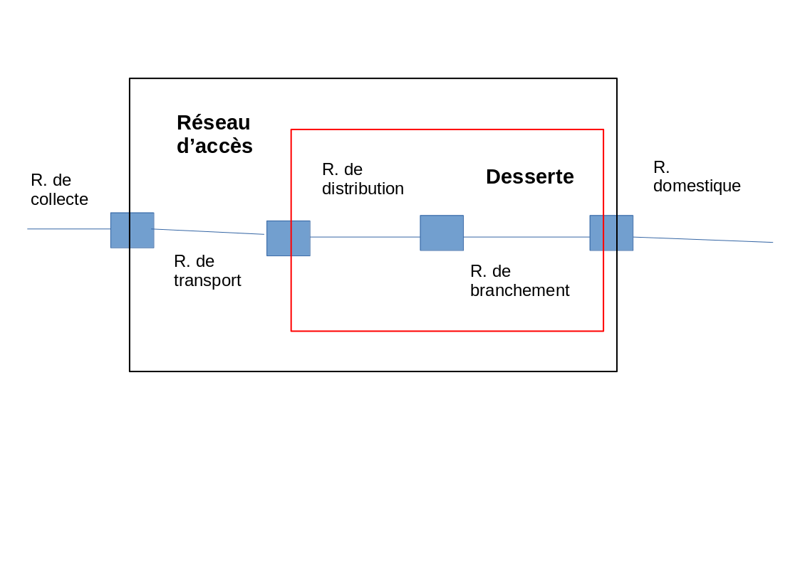

# R307 Etude du réseau d’accès optique en France

## DOMERGUE Mathys

### Partie 1 : Aspects structurels

1)  

    

2) 

3) Les différents acronymes de FTTxx :

   - FTTH qui signifie “fiber to the home” (Fibre non dédiée qui part de l'opérateur vers un point de mutualisation, en cas de problème l'opérateur n'a pas de nécéssité de remise en place de la fibre)

   - FTTLA qui signifie “fiber to the last amplifier”

   - FTTO qui signifie “fiber to the office”
  
   - FTTB qui signifie “fiber to the building”
  
   - FTTN qui signifie “fiber to the node”
  
   - FTTDP qui signifie “fiber to the distribution point”

    > **Note**  
    > source : https://fibre.guide/deploiement/technologies

4) L’architecture P2P (point à point) est une architecture de déploiement de réseaux fibres, qui ne passe pas par le NRO ( nœud de raccordement optique) et qui va du FAI (fournisseur d'accès internet) jusqu’au particulier. L’avantage de cette architecture est qu’il permet d’avoir une allocation qui est dédiée au particulier.

    > **Note**  
    > source : https://fr.wikipedia.org/wiki/FTTH_P2P

5) BLOM : La boucle local optique mutualisée est le déploiement d’une seule fibre qui par la suite va ensuite pouvoir passer par des SRO (sous répartiteur optique) qui ensuite part chez des particuliers.

    BLOD : La boucle local optique dédiée est le déploiement de la fibre du NRO jusqu’au particulier, elle est aussi appelé FTTO
    > **Note**  
    > source : https://www.gersnumerique.fr/harmonisation-des-reseaux/architecture-et-terminologie-du-reseau.html
    >https://essonnenumerique.com/glossaire/blod-boucle-locale-optique-dediee/

6) GPON : Gygabit-capable Passive Optical Network, est un architecture qui multiplexe le trafic de plusieurs abonnés de manière dynamique. La norme du GPON est la norme G.984.x

    > **Note**  
    > source : https://fr.wikipedia.org/wiki/GPON

7) 
    NRO : noeud de raccordement optique, déploiement et 
    obtention du très haut débit
    
    SRO: sous-répartiteur optique, distribution de la fibre vers chez les particuliers
    
    PBO: point de raccordement optique, raccordement final entre un abonné au réseau fibre et son opérateur
    
    PTO: point de terminaison optique, transformation de signal optique en signal électrique

    PM: se trouve entre le NRO et le SRO, il permet de mutualiser sur une même ligne deux opérateurs différents

    OTL: transformation d’un signal électrique en signal optique, se situe côté opérateur

    ONU: conversion du signal optique en signal électrique, se situe dans PTO
.png)

    > **Note**  
    > source : https://www.gersnumerique.fr/harmonisation-des-reseaux/architecture-et-terminologie-du-reseau.html
    >https://essonnenumerique.com/glossaire/blod-boucle-locale-optique-dediee/