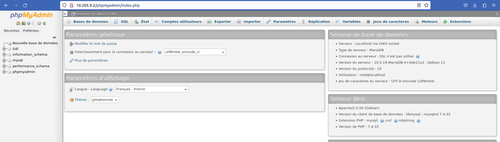

### Mathys Domergue
### RT2 A2

# <center> TP R310


## Installation de MySQL sur un raspberry PI

1) Pour se connecter utiliser la commande :

``` 
ssh pi@10.205.9.2
```

2) Pour l'installation d'un serveur MySQL, je vais utiliser le packet mariadb-server.

``` bash
sudo apt install mariadb-server
sudo apt install apache2 php php-mysql
sudo rm -r /var/lib/mysql/*
sudo mysql_install_db
sudo systemctl restart mysqld
sudo mysql_secure_installation
```

3) Par défault le port d'écoute du serveur est le port TCP 3306


4) On peut se connecter en local avec la commande suivante:

```
sudo mysql -u root -p
```

5) Pour installer apache2 avec php et phpMyadmin, on utilise la commande,

```
sudo apt install apache2 php php-mysql
sudo apt install phpmyadmin
```

6) 

 


7) Pour créer la base de données, on va utilisé l'onglet "Base de données", sur notre site.
