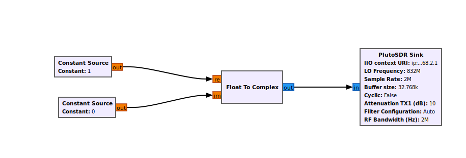
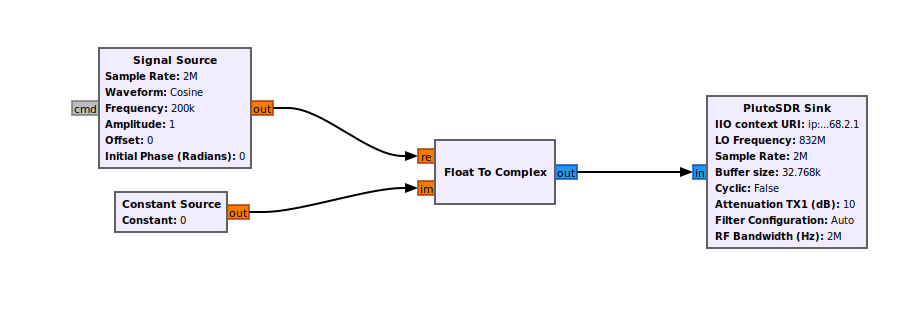
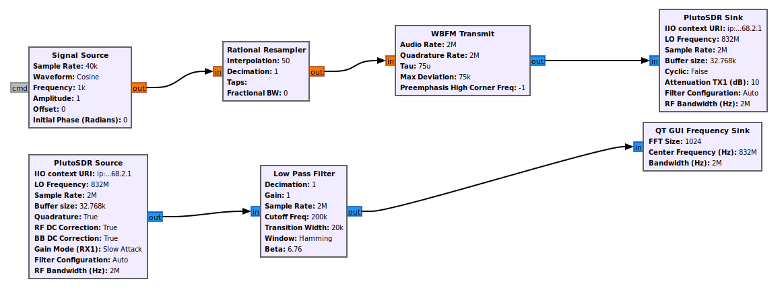
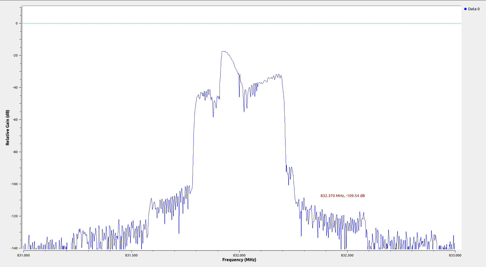
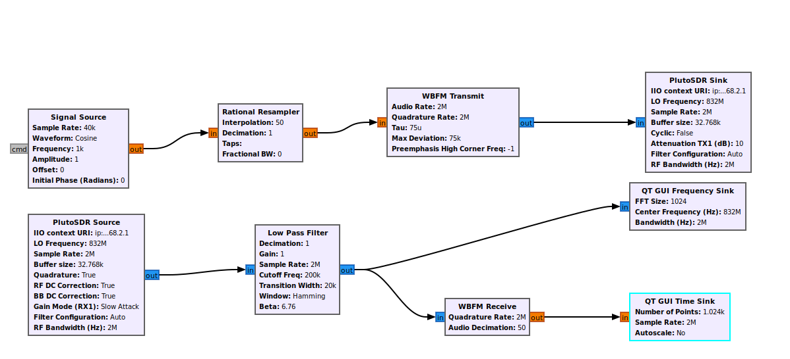
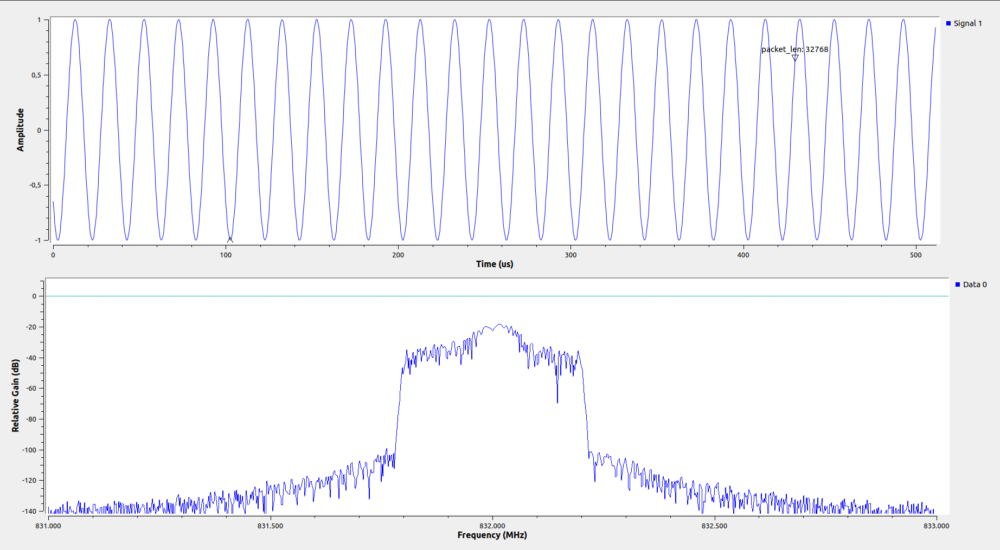
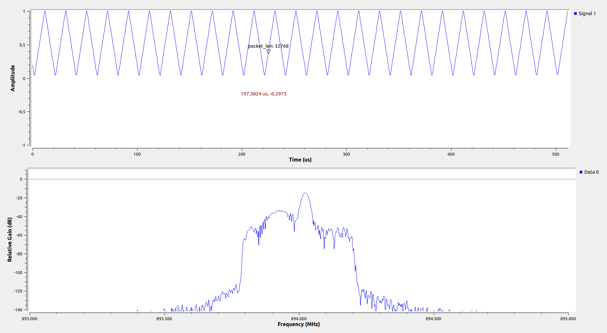

### CAUBEL Aksel
### DOMERGUE Mathys
### RT2 App 
## TP FM
## Transmitions FM

# R321 
# TP Transmission FM

## 3/

Ce digramme va permettre d'envoyer par le biais de l'Adalm-Pluto uniquement la fréquence porteuse. 

## 4/ 

D'après le spectogramme, nous observons bien une raie a la fréquence p (832MHz)

## 5/

Ce diagramme nous permet d'envoyer un signal cosinus autour de la porteuse. 

## 6/

On observe bien une raie à Fp +100kHz et Fp-100kHz

# 5- Transmission de signaux en modulation de fréquence (FM)

## 8/

Ce diagramme émet un signal Sinusoïdale 

## 10/ 

Le spectre est conforme a nos attentes. Il génère une sinusoïde centrer autour de 832MHz (831,9-832,1). 

## 11/

## 12/

## 13/ 

## 14/

Lors de teste avec en Rx notre Tx on reçoit le signal de manière clair. 

Maintenant, losque nous testons de recevoir le signal de nos camarades nous remarquons que le signal reçus peut être bruité en fonction des corps / objets entre leur émeteur et notre receveur.

## 15/ 

La modulation FSK est une modulation qui en fonction du symbole a envoyer va envoier notre sinusoïde a différente fréquence. Un filtre nous permet de recentrer notre vision sur 2MHz.