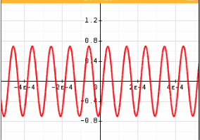

Sur chaque filtre :

 1) Déterminer le type de filtre
 1) Déterminer sa et ses fréquences de coupures
 1) Tracer la sortie du filtre lorsqu'on applique à son entré un signal : $e(t) = sin(2 \pi f )$ avec f=10 kHz
 1) Etudiaer la sortie du fitre pour une entrée sinusoîdale de freq 3 kHz puis 100 kHz

### 
 Filtre 1 

1) Filtre passe-bas
2) Sesfréquences de coupures sont $10^4$ et $10^3$ Hz
3) 

4) 