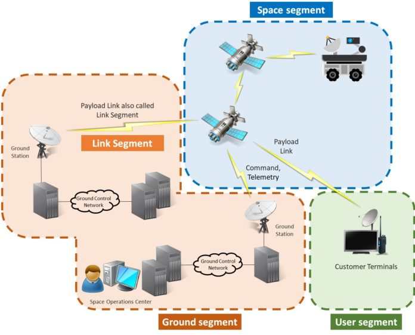

Question de cours

1. La télécommunication par satellite présente quelques propriétés importantes par rapport aux réseaux terrestres. Lesquels ?

1. Quelles sont les parties qui composent l’architecture d’un satellite.
   
   charge utile et plateforme

2. Quels sont les éléments constitutifs de l’architecture d’un système de télécoms par satellites.

4. Citer les différents les différents types d'orbites en décrivant leurs propriétés

    LEO: basse orbite

    MEO moyenne orbite

    GEO: geostationnaire orbite

    GSO: geosynchrone

    HEO: haute obrbite

1.  Quels sont les avantages d'une constellation LEO
   

Mission Mars

1. Les 
