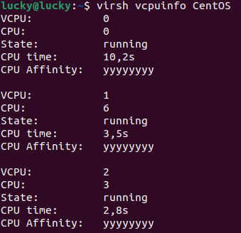

# R3D17


## <center> TP1


## Environnement du TP


### 3.1 Installations nécessaires au TP


### 3.2 URLs p our réaliser une net instal


## 4 Création de machines virtuelles K-VMs


### 4.1 Création de VMs avec virt-manager

#### 4.1.1 Accès à virt-manager

1) 


2) 


3) 
   


4) 


5) 


6) 
   


7) 


### 4.2 Création d'une KVM Debian avec virt-install

1) Voici la commande pour réaliser la VM

```Bash
virt-install  --osinfo detect=on,name=debian12 --vcpus 1 --ram 1024 --disk size=5 -l http://ftp.fr.debian.org/debian/dists/stable/main/installer-amd64/
```

2) 


3) 


### 4.3 Création de VMs avec virt-builder


### 4.4 Création de VMs avec virt-customize


## 5 Découverte de l'architecture KVM

### 5.1 Gestion de réseau

1) 


Le bridge utilisé par ma machine virtuelle est le bridge default.

2) Le bridge fonctionne comme un switch pour les VM de KVM.


3) 


4) 