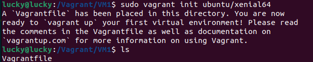
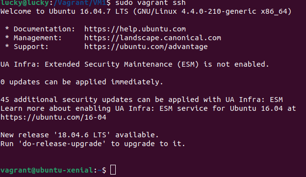
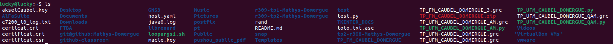
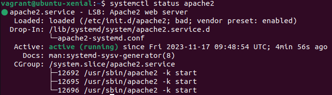
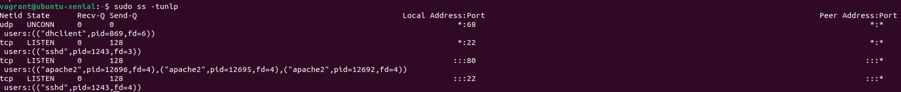

# TP Vagrant

## 1 Vagrant

### 1.1 Création d'une première VM Ubuntu

1) Pour pouvoir créer notre répertoire à la racine nous utilisons la commande suivant

``` Bash
sudo mkdir /Vagrant/
```

2) 


3) 



4) 



5) 


6) m



## 2 Vagrant Customisation VM et construction d'image

### 2.1 Customisation de l'isnntance - Partie 1


La commande permte de fair sortir les commmentaires du fichier Vagrantfiles

1) 
2) m



``` BASH
wget 127.0.0.1
```

3) C'est normal notre machine physique ne connait pas l'adresse de notre machine virtuelle

4) 

### 2.2 Customisation de l'isnntance - Partie 2

### 2.3 Préparation d'une image

## Vagrant advenced version

### 3.1 Vagrant Hub

### 3.2 Autres commandes Vagrant et interaction avec Virtualbox

### 3.3 Vagrant Multi-machines