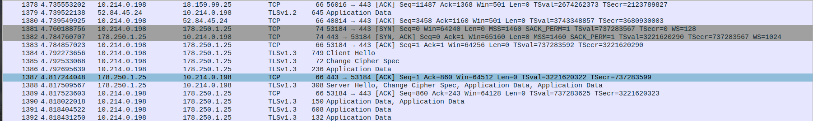

# <center> TP1

Mathys Domergue

Début réaliser avec Askel Caubel jusqu'à la parti 5

# 1. Fonction de hachage
## 1.1 Calcul d'un condensé à l'aide de MD5

### Exercie 1
Le hash est un est une phrase en haxadécimal :

```
b10a8db164e0754105b7a99be72e3fe5
```

### Exercice 2

On obtient 16 condensés différents

### Exercice 3

Il est possible d'avoir du confilt avec MD5 car les possbilités sont moindre par rapport au SHa256 ou SHa512.

## 1.2 Verification des propriétés du condeasé

### Exercice 4

Le hash reste le meme car c'est le contennu du fichier qui est hachée.

## Exercice 5 

Le hash diffère du premier. La simple modification d'un caractère change totalement le hache

```
b9be3ef4018be19f248f6f8e63b9e006
```

## Exercice 6 

Un fichier binaire n'est qu'un fichier remplit de 1 et de 0. Il est donc possible de faire un hache d'un fichier binaire. 

Test effectuer sur un fichier binaire d'un code c++ :

<pre><span style="background-color:#262871"> aksel@RedArch </span><span style="background-color:#12488B"><font color="#262871"> ~/Documents/GitHub/R401-Architectures_securisee/TP-1/file-to-hash </font></span><span style="background-color:#A2734C"><font color="#12488B"></font></span><span style="background-color:#A2734C"><font color="#262871"> main </font></span><font color="#A2734C"></font> md5sum V0.2_ESP-Fenetre-rainSensor.ino.bin 

>>> 7a3d7d2be3c6bf8c84e211786a130a5b  V0.2_ESP-Fenetre-rainSensor.ino.bin
</pre>


# 2. Clefs de chiffrement
## 2.1 Génération de clefs


## Exercice 7 : 

<pre><span style="background-color:#262871"> aksel@RedArch </span><span style="background-color:#12488B"><font color="#262871"> ~/.gnupg </font></span><font color="#12488B"></font> gpg --list-keys
/home/aksel/.gnupg/pubring.kbx
------------------------------
pub   rsa1024 2023-02-27 [SC]
      F54AB41B512674472ACDB54136D043ED57514426
uid           [ultimate] AkselCaubel (A Network &amp; Telecom Student) &lt;aksel.caubel@etu.umontpellier.fr&gt;
sub   rsa1024 2023-02-27 [E]
</pre>

Les différents champs observables sont : 
<pre>
pub -> Il donne l'algorithme utilisé, la taile de bits utilisé avec la date création de la clef publique.
uid -> Le UID Permet de donner l'identifiant de la personne avec l'éventuelle description rentré. 
sub -> Il donne l'algorithme utilisé, la taile de bits utilisé avec la date création de l'empreinte de création.
</pre>


### Exercice 8

Pour regarder les différentes clef que l'on possède sur notre ordinateur, on peut utiliser les différentes options ci dessous ( source : gpg --help )
<pre> 
-k, --list-keys             list keys
     --list-signatures       list keys and signatures
     --check-signatures      list and check key signatures
     --fingerprint           list keys and fingerprints
-K, --list-secret-keys      list secret keys
</pre>

Pour lister les clefs privé il faut donc faire un ***gpg -K*** : 

<pre><span style="background-color:#262871"> aksel@RedArch </span><span style="background-color:#12488B"><font color="#262871"> ~/.gnupg </font></span><font color="#12488B"></font> gpg -K
/home/aksel/.gnupg/pubring.kbx
------------------------------
sec   rsa1024 2023-02-27 [SC]
      F54AB41B512674472ACDB54136D043ED57514426
uid           [ultimate] AkselCaubel (A Network &amp; Telecom Student) &lt;aksel.caubel@etu.umontpellier.fr&gt;
ssb   rsa1024 2023-02-27 [E]
</pre>

Ce qui permet de faire le lien entre les différentes clefs est l'empreinte 

## 2.2 Diffusion de la clef publique

### Exercice 9

le contenu du fichier est : 
<pre><span style="background-color:#262871"> aksel@RedArch </span><span style="background-color:#12488B"><font color="#262871"> ~/.gnupg </font></span><font color="#12488B"></font> cat akselCaubel.key 
-----BEGIN PGP PUBLIC KEY BLOCK-----

mI0EY/ygUgEEAK+h9c8qyl9CtQnNj3LxPBsuDVK1aIDrvdSCyEImaeoqmxZKVdjo
3gxudnvcQlxCnjrryyvS8YtOjpLoBpoSfCXhEb08vOWf8NeQm/N/1Tccqiwz3riZ
GnvL0HEIVjPP3v7MJvib/w5NERaEaVTDQIisMmcpdvGR4GICU9cmQRaNABEBAAG0
TEFrc2VsQ2F1YmVsIChBIE5ldHdvcmsgJiBUZWxlY29tIFN0dWRlbnQpIDxha3Nl
bC5jYXViZWxAZXR1LnVtb250cGVsbGllci5mcj6IzgQTAQoAOBYhBPVKtBtRJnRH
Ks21QTbQQ+1XUUQmBQJj/KBSAhsDBQsJCAcCBhUKCQgLAgQWAgMBAh4BAheAAAoJ
EDbQQ+1XUUQm8oAD/A865cwH0MjNswfXp1+BpqpN6jbYzz3F4EjepXgpfT1ijlB8
oT6Duuld5dEgRr49bz8LJRYfiql4cIoXUxEwVXO7PurMbul+jBPtX/due69l/G9X
XqQUbDG/5VQsqZ5pPdorUiQsz5o79UhNrcw06j96rBciDqQAq79JOGghZCv5uI0E
Y/ygUgEEAJ8yjx2a4Z9EQmUcEj2W+DwveAOKQyr4dRMKC0OrT2OEjsY8J0jzrSpg
W4+S7M7cy/5ePPvWDkyXvoQ9yxokSlZF+moy7uLHztBsTarUfwru+6froQ8RiuFU
lrtATuUu9th58A2IDJ4Rb/dBBa4iZUdkRsbIQ9sgKsG+nDyClpphABEBAAGItgQY
AQoAIBYhBPVKtBtRJnRHKs21QTbQQ+1XUUQmBQJj/KBSAhsMAAoJEDbQQ+1XUUQm
ZkgD/A4tpmq77Pa8VCOatxj2+4QSVp35tGMvqa77TIWzgbGcZ+R5wHKL8zyy8Irx
h+LK9Qd039Svx3V5BCfyCRsbha6cyOIyArNO1Uxc0C1jwAmz/ykA09a5b74ClH0r
JOBYnxrTnQQqw4KSh4xFbOxzXAyxsfG2P2lg3FpRcUcFZ3cHmI0EY/y19gEEAKoI
m8JCYiRfu24OsfseVVwOJI64FN0oKYpqkDgrXfgCUMT2x0NxUxrDAksOqssjei4F
0tNR+5TIyjmhBpNr1P8TKcYGLGUNwU5PTkd0BaypJMdCHS2BDIV+04x67KFwwxRl
6DFgzls3HAuuvzEsYn65EWEBeXOwsX5aW7vJFBt3ABEBAAG0TEFrc2VsQ2F1YmVs
IChBIE5ldHdvcmsgJiBUZWxlY29tIHN0dWRlbnQpIDxha3NlbC5jYXViZWxAZXR1
LnVtb250cGVsbGllci5mcj6I1AQTAQoAPhYhBNB2LEQz04V5+kYjUic/+iJecsyI
BQJj/LX2AhsDBQkAAVGABQsJCAcCBhUKCQgLAgQWAgMBAh4BAheAAAoJECc/+iJe
csyIi3AD/i43dPgNKJ2gRhjR7Wb0B8CMOvdCojAmE/jFbspXZEr72vDmEYMl1l0T
YSqAvXDv3AqU+zYBQXAlMen6W1bKsQ0yNajxDHzHOVyZubsyH8TJOBtP64WUy8Xu
BNB2LEQz04V5+kYjUic/+iJecsyIBQJj/LX2AhsMBQkAAVGAAAoJECc/+iJecsyI
WmUD/jigvK9/rcVN8OOLY3ItHUxXqeo2tGoqH4P1mNWD0MEk6pHftdCWG/sNzxPx
bLm/qPze8JJ9g+6hzNFhOTHAESXUDl5fcwzlGs7I+KWUSUq+brFGfocgQUk1Lyol
YqGQmnROwj4YeFOyz1FU2HbeMy/eXOf7oxH//1WQ4j3G7bQ1
=vhyg
-----END PGP PUBLIC KEY BLOCK-----
</pre>


## Exercice 10 : 

<pre><font color="#50FA7B"><b>│</b></font><span style="background-color:#262871"> aksel@RedArch </span><span style="background-color:#12488B"><font color="#262871"> ~/.gnupg </font></span><font color="#12488B"></font> gpg --export-secret-keys --armor &gt; akselCaubelPriv.key                    <font color="#50FA7B"><b>│</b></font>
<font color="#50FA7B"><b>│</b></font><span style="background-color:#262871"> aksel@RedArch </span><span style="background-color:#12488B"><font color="#262871"> ~/.gnupg </font></span><font color="#12488B"></font> l                                                                         <font color="#50FA7B"><b>│</b></font>
<font color="#50FA7B"><b>│</b></font>total 44K                                                                                             <font color="#50FA7B"><b>│</b></font>
<font color="#50FA7B"><b>│</b></font>drwx------  4 aksel aksel 4,0K 27 févr. 15:12 <font color="#1565C0"></font> .                                                     <font color="#50FA7B"><b>│</b></font>
<font color="#50FA7B"><b>│</b></font>drwxr-x--- 33 aksel aksel 4,0K 27 févr. 15:12 <font color="#1565C0"></font> ..                                                    <font color="#50FA7B"><b>│</b></font>
<font color="#50FA7B"><b>│</b></font>-rw-rw-r--  1 aksel aksel 2,1K 27 févr. 15:02 <font color="#2196F3"></font> akselCaubel.key                                       <font color="#50FA7B"><b>│</b></font>
<font color="#50FA7B"><b>│</b></font>-rw-rw-r--  1 aksel aksel 4,1K 27 févr. 15:12 <font color="#2196F3"></font> akselCaubelPriv.key   </pre>


# 3. Chiffrage d'un fichier
### Exercice 11 : 
Pour pouvoir envoyer un message à mon binôme, il faut avoirla clé publique de mon binôme.

<pre><font color="#50FA7B"><b>│</b></font><span style="background-color:#262871"> aksel@RedArch </span><span style="background-color:#12488B"><font color="#262871"> ~/.gnupg </font></span><font color="#12488B"></font> gpg --import mathysDomergues.key                                          <font color="#50FA7B"><b>│</b></font>
<font color="#50FA7B"><b>│</b></font>gpg: key 9FD5FA5848CD98B1: public key &quot;testt &lt;mail@bonjour.com&gt;&quot; imported                             <font color="#50FA7B"><b>│</b></font>
<font color="#50FA7B"><b>│</b></font>gpg: key 10B47788530F4DB6: public key &quot;Mathys Domergue &lt;mathys.domergue@etu.umontpellier.fr&gt;&quot; imported<font color="#50FA7B"><b>│</b></font>
<font color="#50FA7B"><b>│</b></font>gpg: Total number processed: 2                                                                        <font color="#50FA7B"><b>│</b></font>
<font color="#50FA7B"><b>│</b></font>gpg:               imported: 2 </pre>


### Exercice 12

<pre><font color="#50FA7B"><b>│</b></font>pub   rsa3072 2023-02-27 [SC] [expires: 2025-02-26]                                                   <font color="#50FA7B"><b>│</b></font>
<font color="#50FA7B"><b>│</b></font>      3DD0B9ABE9D72E08BDAC7B0610B47788530F4DB6                                                        <font color="#50FA7B"><b>│</b></font>
<font color="#50FA7B"><b>│</b></font>uid           [ unknown] Mathys Domergue &lt;mathys.domergue@etu.umontpellier.fr&gt;                        <font color="#50FA7B"><b>│</b></font>
<font color="#50FA7B"><b>│</b></font>sub   rsa3072 2023-02-27 [E] [expires: 2025-02-26]                                                    <font color="#50FA7B"><b>│</b></font>
<font color="#50FA7B"><b>│</b></font>                                                                                                      <font color="#50FA7B"><b>│</b></font>
<font color="#50FA7B"><b>│</b></font><span style="background-color:#262871"> aksel@RedArch </span><span style="background-color:#12488B"><font color="#262871"> ~/.gnupg </font></span><font color="#12488B"></font>  </pre>

### Exercice 13 : 

<pre><font color="#50FA7B"><b>│</b></font><span style="background-color:#262871"> aksel@RedArch </span><span style="background-color:#12488B"><font color="#262871"> ~/.gnupg </font></span><font color="#12488B"></font> gpg --decrypt toto.txt.asc &gt; toto.txt                                    <font color="#50FA7B"><b>│</b></font>
<font color="#50FA7B"><b>│</b></font>gpg: encrypted with 1024-bit RSA key, ID FBEA4C286A0D7DAE, created 2023-02-27                        <font color="#50FA7B"><b>│</b></font>
<font color="#50FA7B"><b>│</b></font>      &quot;AkselCaubel (A Network &amp; Telecom student) &lt;aksel.caubel@etu.umontpellier.fr&gt;&quot;
<font color="#50FA7B"><b>│</b></font><span style="background-color:#262871"> aksel@RedArch </span><span style="background-color:#12488B"><font color="#262871"> ~/.gnupg </font></span><font color="#12488B"></font> cat toto.txt                                                             <font color="#50FA7B"><b>│</b></font>
<font color="#50FA7B"><b>│</b></font>hello word !</pre>

### Exercice 14

Il est bien l'équivalent du fichier initial


# 4 Signature numérique
## 4.1 Signature d'un fichier


### Exercice 15 

<pre><font color="#50FA7B"><b>│</b></font><span style="background-color:#262871"> aksel@RedArch </span><span style="background-color:#12488B"><font color="#262871"> ~/.gnupg </font></span><font color="#12488B"></font> gpg --detach-sign --clearsign Mytoto.txt                                 <font color="#50FA7B"><b>│</b></font>
<font color="#50FA7B"><b>│</b></font>File &apos;Mytoto.txt.asc&apos; exists. Overwrite? (y/N) y                                                     <font color="#50FA7B"><b>│</b></font>
<font color="#50FA7B"><b>│</b></font><span style="background-color:#262871"> aksel@RedArch </span><span style="background-color:#12488B"><font color="#262871"> ~/.gnupg </font></span><font color="#12488B"></font> cat Mytoto.txt.asc                                                       <font color="#50FA7B"><b>│</b></font>
<font color="#50FA7B"><b>│</b></font>-----BEGIN PGP SIGNED MESSAGE-----                                                                   <font color="#50FA7B"><b>│</b></font>
<font color="#50FA7B"><b>│</b></font>Hash: SHA512                                                                                         <font color="#50FA7B"><b>│</b></font>
<font color="#50FA7B"><b>│</b></font>                                                                                                     <font color="#50FA7B"><b>│</b></font>
<font color="#50FA7B"><b>│</b></font>Hello Mate !                                                                                         <font color="#50FA7B"><b>│</b></font>
<font color="#50FA7B"><b>│</b></font>-----BEGIN PGP SIGNATURE-----                                                                        <font color="#50FA7B"><b>│</b></font>
<font color="#50FA7B"><b>│</b></font>                                                                                                     <font color="#50FA7B"><b>│</b></font>
<font color="#50FA7B"><b>│</b></font>iLMEAQEKAB0WIQT1SrQbUSZ0RyrNtUE20EPtV1FEJgUCY/y+oAAKCRA20EPtV1FE                                     <font color="#50FA7B"><b>│</b></font>
<font color="#50FA7B"><b>│</b></font>JilHA/sHNZ3qcMfvXMt2nCia6ia9UTqxLCVl3KlAL1uttJ+BtFIPQV70YvnyXKpm                                     <font color="#50FA7B"><b>│</b></font>
<font color="#50FA7B"><b>│</b></font>FHPmV82EruGE7yG+wLOe6ZEUuwZd/fJC64VTCEh7bCZ57VELH8c7mP/kPsUZWL9M                                     <font color="#50FA7B"><b>│</b></font>
<font color="#50FA7B"><b>│</b></font>vFFQiFgwuKG6EMh5YAEyaaA2N491O4lT1fgcToFqE4lczQJCsg==                                                 <font color="#50FA7B"><b>│</b></font>
<font color="#50FA7B"><b>│</b></font>=cX9l                                                                                                <font color="#50FA7B"><b>│</b></font>
<font color="#50FA7B"><b>│</b></font>-----END PGP SIGNATURE----- </pre>

### Exercice 16

<pre><font color="#50FA7B"><b>│</b></font><span style="background-color:#262871"> aksel@RedArch </span><span style="background-color:#12488B"><font color="#262871"> ~/.gnupg </font></span><font color="#12488B"></font> gpg --verify Mytoto.txt.asc                                              <font color="#50FA7B"><b>│</b></font>
<font color="#50FA7B"><b>│</b></font>gpg: Signature made lun. 27 févr. 2023 15:30:56 CET                                                  <font color="#50FA7B"><b>│</b></font>
<font color="#50FA7B"><b>│</b></font>gpg:                using RSA key F54AB41B512674472ACDB54136D043ED57514426                           <font color="#50FA7B"><b>│</b></font>
<font color="#50FA7B"><b>│</b></font>gpg: Good signature from &quot;AkselCaubel (A Network &amp; Telecom Student) &lt;aksel.caubel@etu.umontpellier.fr<font color="#50FA7B"><b>│</b></font>
<font color="#50FA7B"><b>│</b></font>&gt;&quot; [ultimate] </pre>


## 4.2 Signature d'une clef publique

### Exercice 17
<pre><span style="background-color:#262871">aksel@RedArch </span><span style="background-color:#12488B"><font color="#262871"> ~/.gnupg </font></span><font color="#12488B"></font> gpg --sign-key 3DD0B9ABE9D72E08BDAC7B0610B47788530F4DB6                <font color="#50FA7B"><b>│</b></font>
<font color="#50FA7B"><b>│</b></font>                                                                                                     <font color="#50FA7B"><b>│</b></font>
<font color="#50FA7B"><b>│</b></font>pub  rsa3072/10B47788530F4DB6                                                                        <font color="#50FA7B"><b>│</b></font>
<font color="#50FA7B"><b>│</b></font>     created: 2023-02-27  expires: 2025-02-26  usage: SC                                             <font color="#50FA7B"><b>│</b></font>
<font color="#50FA7B"><b>│</b></font>     trust: unknown       validity: unknown                                                          <font color="#50FA7B"><b>│</b></font>
<font color="#50FA7B"><b>│</b></font>sub  rsa3072/7A5AAC8D2BA6FBBA                                                                        <font color="#50FA7B"><b>│</b></font>
<font color="#50FA7B"><b>│</b></font>     created: 2023-02-27  expires: 2025-02-26  usage: E                                              <font color="#50FA7B"><b>│</b></font>
<font color="#50FA7B"><b>│</b></font>[ unknown] (1). Mathys Domergue &lt;mathys.domergue@etu.umontpellier.fr&gt;                                <font color="#50FA7B"><b>│</b></font>
<font color="#50FA7B"><b>│</b></font>                                                                                                     <font color="#50FA7B"><b>│</b></font>
<font color="#50FA7B"><b>│</b></font>                                                                                                     <font color="#50FA7B"><b>│</b></font>
<font color="#50FA7B"><b>│</b></font>pub  rsa3072/10B47788530F4DB6                                                                        <font color="#50FA7B"><b>│</b></font>
<font color="#50FA7B"><b>│</b></font>     created: 2023-02-27  expires: 2025-02-26  usage: SC                                             <font color="#50FA7B"><b>│</b></font>
<font color="#50FA7B"><b>│</b></font>     trust: unknown       validity: unknown                                                          <font color="#50FA7B"><b>│</b></font>
<font color="#50FA7B"><b>│</b></font> Primary key fingerprint: 3DD0 B9AB E9D7 2E08 BDAC  7B06 10B4 7788 530F 4DB6                         <font color="#50FA7B"><b>│</b></font>
<font color="#50FA7B"><b>│</b></font>                                                                                                     <font color="#50FA7B"><b>│</b></font>
<font color="#50FA7B"><b>│</b></font>     Mathys Domergue &lt;mathys.domergue@etu.umontpellier.fr&gt;                                           <font color="#50FA7B"><b>│</b></font>
<font color="#50FA7B"><b>│</b></font>                                                                                                     <font color="#50FA7B"><b>│</b></font>
<font color="#50FA7B"><b>│</b></font>This key is due to expire on 2025-02-26.                                                             <font color="#50FA7B"><b>│</b></font>
<font color="#50FA7B"><b>│</b></font>Are you sure that you want to sign this key with your                                                <font color="#50FA7B"><b>│</b></font>
<font color="#50FA7B"><b>│</b></font>key &quot;AkselCaubel (A Network &amp; Telecom Student) &lt;aksel.caubel@etu.umontpellier.fr&gt;&quot; (36D043ED57514426)<font color="#50FA7B"><b>│</b></font>
<font color="#50FA7B"><b>│</b></font>                                                                                                     <font color="#50FA7B"><b>│</b></font>
<font color="#50FA7B"><b>│</b></font>Really sign? (y/N) y                                                                                 <font color="#50FA7B"><b>│</b></font>
<font color="#50FA7B"><b>│</b></font>                                                                                                     <font color="#50FA7B"><b>│</b></font>
<font color="#50FA7B"><b>│</b></font><span style="background-color:#262871"> aksel@RedArch </span><span style="background-color:#12488B"><font color="#262871"> ~/.gnupg </font></span><font color="#12488B"></font></pre>

# 5. Utilisation d'un certificat


### Exercice 18



### Exercice 19

Le problème pour les admin est qu'ils n'ont plus accés au données