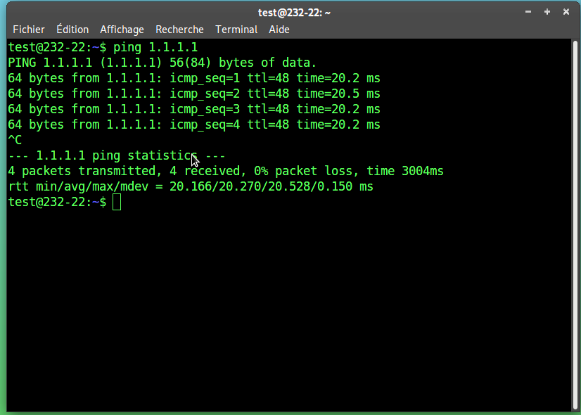

### DOMERGUE Mathys
### RT2 App

# 
 TP2 R401

## 1. Question primaires

Exercice 1

Pour que le client interne puisse avoir internet, on va utilisé la commande iptables

Exercice 2

Configuration Client OPENVPN

Configuration Passerelle

Configuration Client interne

Configuration IPTABLES

## 2. Premiers tests

Exercice 4

<pre>
Sur la passerelle :

openvpn --dev tun0 --ifconfig 10.10.10.1 10.10.10.2

Sur le client Openvpn:

openvpn --remote 10.0.2.2 --dev tun0 --ifconfig 10.10.10.2 10.10.10.1
</pre>

Exercice 5

Exercice 6

Interface passerelle :

Interface Oenvpn :

On peut remarquer dans les deux cas que notre machine obtient une nouvelle interface pour la communication VPN

Exercice 7

## 3. Ajout d'une clé sécurisé

Exercice 9

Exercice 10

La clée est une clée vpn.

Exercice 11

La longueur de la clée est de 2048 bits.