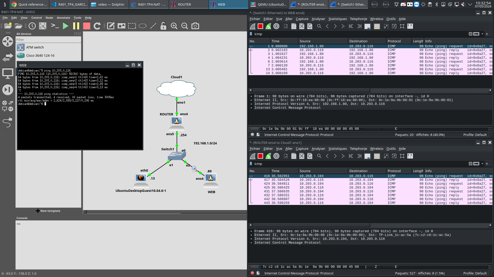
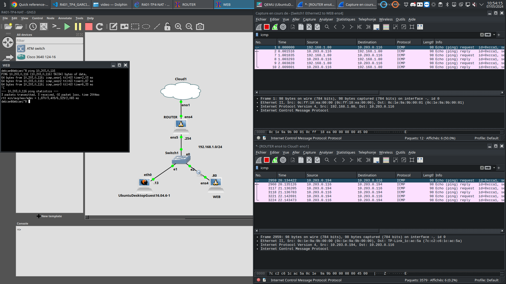
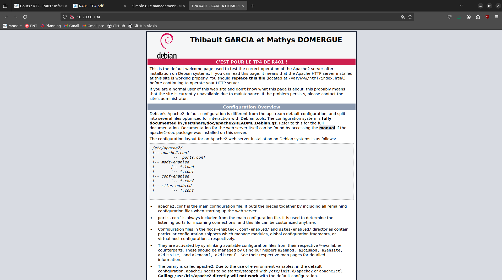
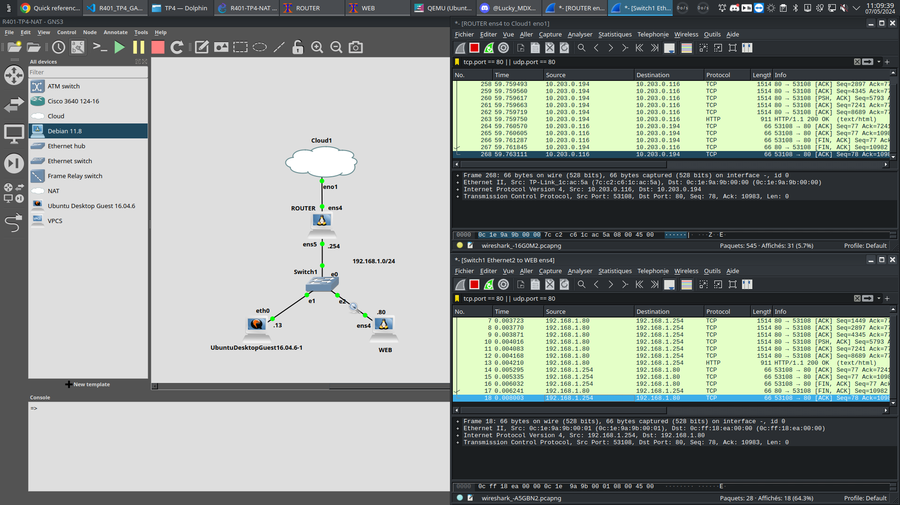

## <center> NAT et Filtrage sous linux

Adressage: PC2: 10.203.0.116
           Routeur, réseau de la salle: 10.203.0.194
           Routeur, réseau privé: 192.168.1.254
           Serveur Web:
           PC1:


### 1. Le NAT

#### 1.1 SNAT

1) Le SNAT doit être sur le hook PostRouting, ceci est une action sur la sorti d'interface.

2) Voici les commandes

```bash
nft add table nat
nft add chain nat natexterne {type nat hook postrouting priority 0 \;}
nft add rule nat natexterne ip saddr 192.168.1.0/24 oif ens4 snat 10.203.0.194
```

3) On peut effectuer un ping, voici le résultat:



#### 1.2 MASQUERADE

4) Voici les commandes à mettre, et la preuve avec le ping:

```bash
nft -n -a list table nat #permet de lister la table de nat avec le numéro de handle, c'est mieux que nft list ruleset.
nft delete rule nat natexterne handle 11 #handle est la position de la règle.
nft add rule nat natexterne masquerade
```


#### 1.3 DNAT

5) La règle de DNAT se place sur le hook du prerooting.

6) Voici les règles utilisées: 

```bash
nft nft add chain nat dstnat {type nat hook prerouting priority 0 \;}
nft add rule ip nat dstnat iif ens4 tcp dport 80 dnat 192.168.1.80:80
```

7) Voici la page du serveur web depuis le PC2:




### 2. Filtrage

#### 2.1 Sans état: Stateless

8) Voici la règle utilisée:

```bash
nft add rule filter refus ip daddr 141.94.78.218 drop
```
La limite des cette méthode est les grosses structures comme Youtube ou Facebook, avec beaucoup de serveurs.

9) Voici le filtre

```bash
nft add rule filter refus iif ens5 tcp dport 22 reject
```

10) Par default, il vaut mieux de mettre une table en drop puis d'ajouter les règles une par une.

11) 

#### 2.2 Avec état: Satefull

