Author: Mathys Domergue

## 
 TP1 Sites Mobile - FH

### 1. Localisation des antennes des réseaux 2G/3G/4G/5G

1) 
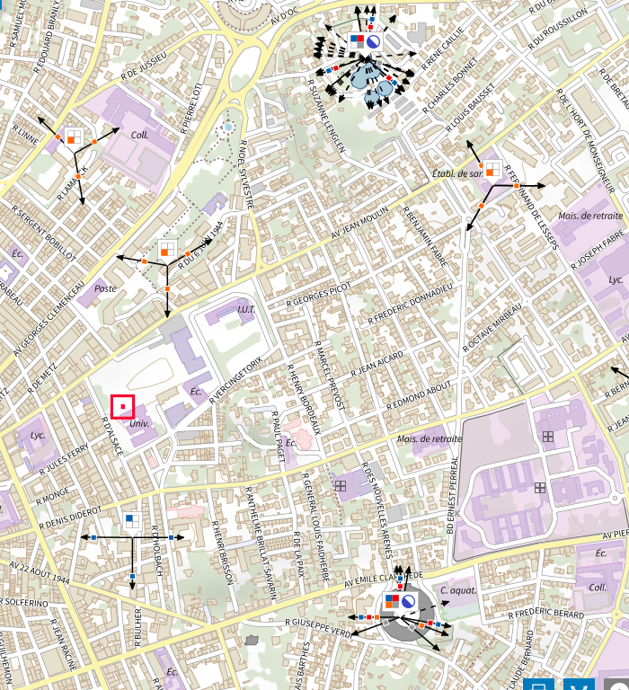

2) L'IUT de Béziers à pour coordonnées Latitude : 43.3468, longitude :  3.2224

3) Coordonnées du château d'eau 3.2278, 43.35306  
    Coordonnées du arènes 3.22861, 43.34333

4) Détail des antènes du château d'eau: 
   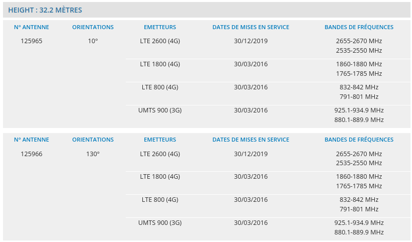
   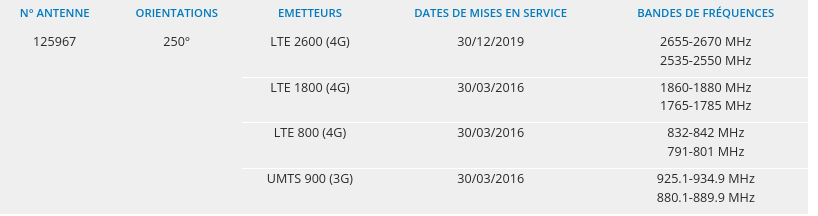

   Détail des antènes des arènes :  
    Azimuth : L'azimut est mesuré depuis le nord de 0° (inclus) à 360° (exclu) dans le sens rétrograde (sens des aiguilles d'une montre) : l'est est à 90°, le sud à 180° et l'ouest à 270°. ([Wikipédia](https://fr.wikipedia.org/wiki/Azimut))

### 2. Faisceaux Hertziens

1) Faisceau hertzien : Un faisceau hertzien est un système de transmission de signaux — aujourd'hui principalement numériques — mono-directionnel ou bi-directionnel et généralement permanent, entre deux sites géographiques fixes. Il exploite le support d'ondes radioélectriques, par des fréquences porteuses allant de 1 à 86 GHz1 (gamme des micro-ondes), focalisées et concentrées grâce à des antennes directives. Il permet notamment de véhiculer des signaux sonores, la radio, de la vidéo, des chaînes de télévision ou des télécommunications et permet éventuellement d'échanger ces données entre les différents points du réseau qu'il dessert. ([Wikipédia](https://fr.wikipedia.org/wiki/Faisceau_hertzien))

2) FH Château d'eau :
    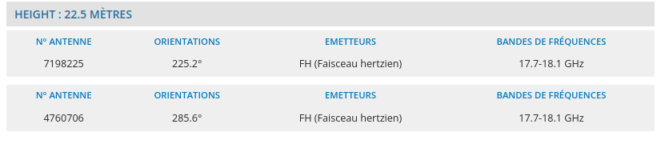
    FH Arènes:
    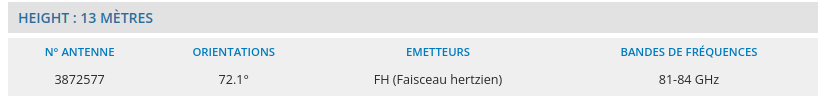

3) Pour les antènes du chaeau d'eau :

    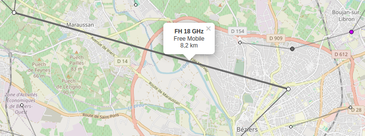
    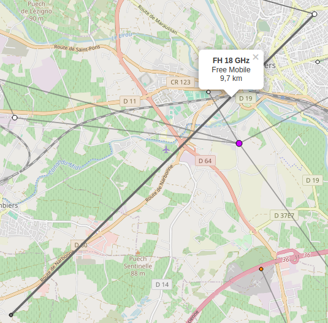

    Pour les antènes des arènes :
    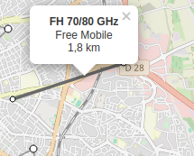

4) Pour camjac, nous avons :  
   - IMGP1579.JPG  
   - 20191017_152415.jpg  
   - 20191017_152422.jpg  
   - 20191017_152559.jpg
   
   Pour Sauveterre de rouergue, nous avons:  
    - RIMG8782.JPG  
    - RIMG8735.JPG

5) Voici la distance entre les deux antènnes :
   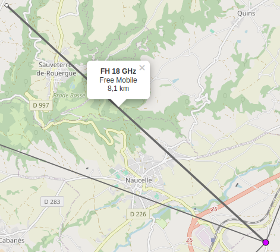  
    Pour les images où l'on peut voir les deux antennes, nous :
    - RIMG8751.jpg
    - RIMG8751.jpg
6)

7) Voici les info pour les deux antennes :

    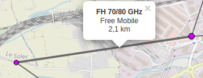
    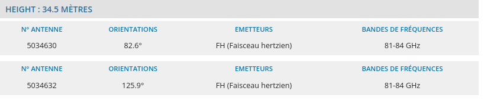
    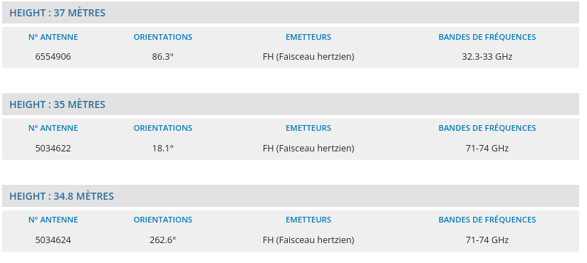

8) 