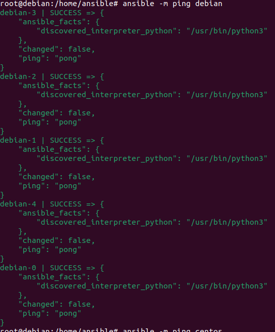
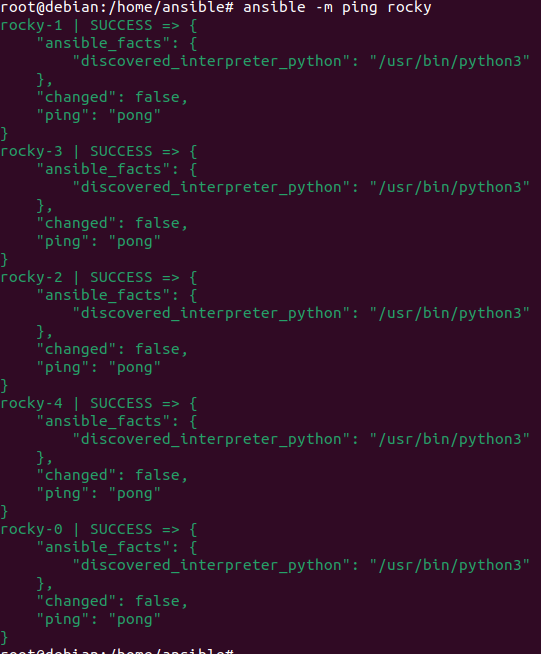

## <center> TP Gestion des configurations: Powerfull Ansible !

### 4 Prise en main d’Ansible
#### 4.1 Vérification et "debug" basique

1) 
  


2)
```
    root@debian:/home/ansible# ansible-console
    Welcome to the ansible console. Type help or ? to list commands.

    root@all (13)[f:5]$ ip -br a
    debian-0 | CHANGED | rc=0 >>
    lo               UNKNOWN        127.0.0.1/8 ::1/128 
    eth0@if35        UP             172.28.0.2/16 fe80::42:acff:fe1c:2/64 
    debian-1 | CHANGED | rc=0 >>
    lo               UNKNOWN        127.0.0.1/8 ::1/128 
    eth0@if37        UP             172.29.0.2/16 fe80::42:acff:fe1d:2/64
    debian-3 | CHANGED | rc=0 >>
    lo               UNKNOWN        127.0.0.1/8 ::1/128 
    eth0@if41        UP             172.31.0.2/16 fe80::42:acff:fe1f:2/64 
    debian-2 | CHANGED | rc=0 >>
    lo               UNKNOWN        127.0.0.1/8 ::1/128 
    eth0@if39        UP             172.30.0.2/16 fe80::42:acff:fe1e:2/64 
    debian-4 | CHANGED | rc=0 >>
    lo               UNKNOWN        127.0.0.1/8 ::1/128 
    eth0@if43        UP             192.168.0.2/20 fe80::42:c0ff:fea8:2/64 
    rocky-1 | CHANGED | rc=0 >>
    lo               UNKNOWN        127.0.0.1/8 ::1/128 
    eth0@if27        UP             172.19.0.2/16 fe80::42:acff:fe13:2/64 
    rocky-0 | CHANGED | rc=0 >>
    lo               UNKNOWN        127.0.0.1/8 ::1/128 
    eth0@if25        UP             172.18.0.2/16 fe80::42:acff:fe12:2/64 
    rocky-2 | CHANGED | rc=0 >>
    lo               UNKNOWN        127.0.0.1/8 ::1/128 
    eth0@if29        UP             172.20.0.2/16 fe80::42:acff:fe14:2/64 
    rocky-4 | CHANGED | rc=0 >>
    lo               UNKNOWN        127.0.0.1/8 ::1/128 
    eth0@if33        UP             172.22.0.2/16 fe80::42:acff:fe16:2/64 
    rocky-3 | CHANGED | rc=0 >>
    lo               UNKNOWN        127.0.0.1/8 ::1/128 
    eth0@if31        UP             172.21.0.2/16 fe80::42:acff:fe15:2/64 
```

3) Ansible utilise le protocole SSH pour se connecter aux containers.

5) Voici la sortie de la commande ansible-inventory
```
root@debian:/home/ansible# ansible-inventory --list all
{
    "_meta": {
        "hostvars": {
            "clab-srlceos01-ceos1": {
                "ansible_become": true,
                "ansible_become_method": "enable",
                "ansible_connection": "ansible.netcommon.network_cli",
                "ansible_host": "172.100.100.2",
                "ansible_network_os": "arista.eos.eos",
                "ansible_password": "admin",
                "ansible_user": "admin"
            },
            "clab-srlceos01-ceos2": {
                "ansible_become": true,
                "ansible_become_method": "enable",
                "ansible_connection": "ansible.netcommon.network_cli",
                "ansible_host": "172.100.100.3",
                "ansible_network_os": "arista.eos.eos",
                "ansible_password": "admin",
                "ansible_user": "admin"
            },
            "clab-srlceos01-ceos3": {
                "ansible_become": true,
                "ansible_become_method": "enable",
                "ansible_connection": "ansible.netcommon.network_cli",
                "ansible_host": "172.100.100.4",
                "ansible_network_os": "arista.eos.eos",
                "ansible_password": "admin",
                "ansible_user": "admin"
            },
            "debian-0": {
                "ansible_host": "127.0.0.1",
                "ansible_port": 2220,
                "ansible_ssh_private_key_file": "~/.ssh/id_ed25519"
            },
            "debian-1": {
                "ansible_host": "127.0.0.1",
                "ansible_port": 2221,
                "ansible_ssh_private_key_file": "~/.ssh/id_ed25519"
            },
            "debian-2": {
                "ansible_host": "127.0.0.1",
                "ansible_port": 2222,
                "ansible_ssh_private_key_file": "~/.ssh/id_ed25519"
            },
            "debian-3": {
                "ansible_host": "127.0.0.1",
                "ansible_port": 2223,
                "ansible_ssh_private_key_file": "~/.ssh/id_ed25519"
            },
            "debian-4": {
                "ansible_host": "127.0.0.1",
                "ansible_port": 2224,
                "ansible_ssh_private_key_file": "~/.ssh/id_ed25519"
            },
            "rocky-0": {
                "ansible_host": "127.0.0.1",
                "ansible_port": 3220,
                "ansible_ssh_private_key_file": "~/.ssh/id_ed25519"
            },
            "rocky-1": {
                "ansible_host": "127.0.0.1",
                "ansible_port": 3221,
                "ansible_ssh_private_key_file": "~/.ssh/id_ed25519"
            },
            "rocky-2": {
                "ansible_host": "127.0.0.1",
                "ansible_port": 3222,
                "ansible_ssh_private_key_file": "~/.ssh/id_ed25519"
            },
            "rocky-3": {
                "ansible_host": "127.0.0.1",
                "ansible_port": 3223,
                "ansible_ssh_private_key_file": "~/.ssh/id_ed25519"
            },
            "rocky-4": {
                "ansible_host": "127.0.0.1",
                "ansible_port": 3224,
                "ansible_ssh_private_key_file": "~/.ssh/id_ed25519"
            }
        }
    },
    "all": {
        "children": [
            "ungrouped",
            "linux",
            "eos"
        ]
    },
    "debian": {
        "hosts": [
            "debian-0",
            "debian-1",
            "debian-2",
            "debian-3",
            "debian-4"
        ]
    },
    "eos": {
        "hosts": [
            "clab-srlceos01-ceos1",
            "clab-srlceos01-ceos2",
            "clab-srlceos01-ceos3"
        ]
    },
    "linux": {
        "children": [
            "debian",
            "rocky"
        ]
    },
    "rocky": {
        "hosts": [
            "rocky-0",
            "rocky-1",
            "rocky-2",
            "rocky-3",
            "rocky-4"
        ]
    }
}

```