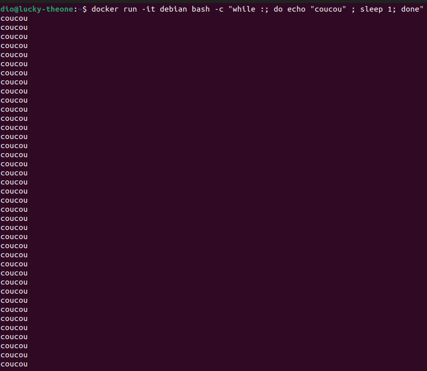

## <center> TP/TD Docker


### 3. Dcoker sous Linux

1) 
``` SH
dio@lucky-theone:~$ docker -v
Docker version 26.1.0, build 9714adc

dio@lucky-theone:~$ systemctl status docker
● docker.service - Docker Application Container Engine
     Loaded: loaded (/lib/systemd/system/docker.service; enabled; vendor preset: enabled)
     Active: active (running) since Mon 2024-04-29 10:32:52 CEST; 1h 5min ago
TriggeredBy: ● docker.socket
       Docs: https://docs.docker.com
   Main PID: 36896 (dockerd)
      Tasks: 18
     Memory: 31.9M
        CPU: 1.753s
     CGroup: /system.slice/docker.service
             └─36896 /usr/bin/dockerd -H fd:// --containerd=/run/containerd/containerd.sock

avril 29 10:32:51 lucky-theone dockerd[36896]: time="2024-04-29T10:32:51.499656810+02:00" level=info msg="[graphdriver] using prior storage driver: overlay2"
avril 29 10:32:51 lucky-theone dockerd[36896]: time="2024-04-29T10:32:51.499933052+02:00" level=info msg="Loading containers: start."
avril 29 10:32:52 lucky-theone dockerd[36896]: time="2024-04-29T10:32:52.112122407+02:00" level=info msg="Default bridge (docker0) is assigned with an IP address 172.17.0.0/16. Daemon option --bip can be used t>
avril 29 10:32:52 lucky-theone dockerd[36896]: time="2024-04-29T10:32:52.208222966+02:00" level=info msg="Loading containers: done."
avril 29 10:32:52 lucky-theone dockerd[36896]: time="2024-04-29T10:32:52.222050603+02:00" level=info msg="Docker daemon" commit=c8af8eb containerd-snapshotter=false storage-driver=overlay2 version=26.1.0
avril 29 10:32:52 lucky-theone dockerd[36896]: time="2024-04-29T10:32:52.222103345+02:00" level=info msg="Daemon has completed initialization"
avril 29 10:32:52 lucky-theone dockerd[36896]: time="2024-04-29T10:32:52.247484275+02:00" level=info msg="API listen on /run/docker.sock"
avril 29 10:32:52 lucky-theone systemd[1]: Started Docker Application Container Engine.
avril 29 10:34:36 lucky-theone dockerd[36896]: time="2024-04-29T10:34:36.206005972+02:00" level=info msg="ignoring event" container=cb1f80b073ca288a8ecc66c86b928263bc18792501fa3b0144dc2a2323bf7696 module=libcon>
avril 29 11:16:27 lucky-theone dockerd[36896]: time="2024-04-29T11:16:27.871109704+02:00" level=info msg="ignoring event" container=6b742696e029cc8c51d5759335a623048680722fe36d944a66259c0582960252 module=libcon>
lines 1-22/22 (END)
```

2) 
```sh
dio@lucky-theone:~$ docker run hello-world

Hello from Docker!
This message shows that your installation appears to be working correctly.

To generate this message, Docker took the following steps:
 1. The Docker client contacted the Docker daemon.
 2. The Docker daemon pulled the "hello-world" image from the Docker Hub.
    (amd64)
 3. The Docker daemon created a new container from that image which runs the
    executable that produces the output you are currently reading.
 4. The Docker daemon streamed that output to the Docker client, which sent it
    to your terminal.

To try something more ambitious, you can run an Ubuntu container with:
 $ docker run -it ubuntu bash

Share images, automate workflows, and more with a free Docker ID:
 https://hub.docker.com/

For more examples and ideas, visit:
 https://docs.docker.com/get-started/

```

a) Dcoker nous indique comment il a généré le message 'Hello from Docker'

b) 

> *Lien*  
>https://hub.docker.com/_/hello-world

c)

3) Voici la listes des images de Busybox :

```
dio@lucky-theone:~$ docker search busybox
NAME                                DESCRIPTION                                     STARS     OFFICIAL
busybox                             Busybox base image.                             3243      [OK]
rancher/busybox                                                                     0         
chainguard/busybox                  Build, ship and run secure software with Cha…   0         
openebs/busybox-client                                                              1         
antrea/busybox                                                                      1         
airbyte/busybox                                                                     0         
hugegraph/busybox                   test image                                      2         
privatebin/chown                     Docker image providing busybox' chown, stat…   1         
yauritux/busybox-curl               Busybox with CURL                               25        
radial/busyboxplus                  Full-chain, Internet enabled, busybox made f…   56        
vukomir/busybox                     busybox and curl                                1         
arm64v8/busybox                     Busybox base image.                             8         
odise/busybox-curl                                                                  4         
busybox42/zimbra-docker-centos      A Zimbra Docker image, based in ZCS 8.8.9 an…   2         
amd64/busybox                       Busybox base image.                             1         
busybox42/alpine-pod                                                                0         
joeshaw/busybox-nonroot             Busybox container with non-root user nobody     2         
p7ppc64/busybox                     Busybox base image for ppc64.                   2         
ppc64le/busybox                     Busybox base image.                             1         
s390x/busybox                       Busybox base image.                             3         
i386/busybox                        Busybox base image.                             3         
arm32v7/busybox                     Busybox base image.                             10        
prom/busybox                        Prometheus Busybox Docker base images           2         
busybox42/nginx_php-docker-centos   This is a nginx/php-fpm server running on Ce…   1         
spotify/busybox                     Spotify fork of https://hub.docker.com/_/bus…   1        
```

5) On constate que le docker est créé masi n'est pas vivant.
   ```
    dio@lucky-theone:~$ docker ps
    CONTAINER ID   IMAGE     COMMAND   CREATED   STATUS    PORTS     NAMES
    dio@lucky-theone:~$ docker ps -al
    CONTAINER ID   IMAGE     COMMAND   CREATED              STATUS                          PORTS     NAMES
    94e8fea343ba   debian    "bash"    About a minute ago   Exited (0) About a minute ago             confident_lovelace
   ```
6) 
    ``` sh
    dio@lucky-theone:~$ docker run -d debian bash -c "while :; do echo "coucou" ; sleep 1; done"
    cd048a55dfa806aae37f1ef5f5a757ce3420eddbee4bd5c29dbe1ad26b5b2e7b
    ```
    Si on refait un 'docker ps', on constate que le docker est vivant :

    ``` sh
    dio@lucky-theone:~$ docker ps
    CONTAINER ID   IMAGE     COMMAND                  CREATED         STATUS         PORTS     NAMES
    cd048a55dfa8   debian    "bash -c 'while :; d…"   2 minutes ago   Up 2 minutes             cranky_hofstadter
    ```

7) Pour arrêter puis redémarrer, on passse les commandes suivantes:
   ```
   dio@lucky-theone:~$ docker stop cd
    cd
    dio@lucky-theone:~$ docker start cd
    cd
   ```

8) 
```sh
dio@lucky-theone:~$ docker rm cd
Error response from daemon: cannot remove container "/cranky_hofstadter": container is running: stop the container beforeremoving or force remove
dio@lucky-theone:~$ docker stop cd
cd
dio@lucky-theone:~$ docker rm cd
cd
```

9) Voici la commande avec -it:


10) Voici la commande :
```sh
dio@lucky-theone:~$ docker run -it --name DebianOne -h DebianOne debian
root@DebianOne:/# 
```

11) Voici les commandes à utiliser :

```sh
dio@lucky-theone:~$ docker run -it --name DebianOne -h DebianOne debian
root@DebianOne:/# exit
exit
dio@lucky-theone:~$ docker start DebianOne
DebianOne
dio@lucky-theone:~$ docker attach DebianOne
root@DebianOne:/# 
```

12) 
```sh
dio@lucky-theone:~$ docker exec DebianOne echo a && echo b
a
b
```  
13) 
``` sh
docker ps -l
```

14) 


### 4. Création d'images Docker

#### 4.1 Build d'une image Docker Debian


1) Voici la commande :

```sh
docker build - t debian:md .
```

2) RUN permet de d'exécuter une commande, ENV, précise l'environement, et  FROM permet de créer une nouvelle image à partir d'une image déjà présente

3) Cela permet d'avoir qu'une seul couche pour les ressources apt

4) Voici le fichier Dockerfile
```bash
FROM debian:md

RUN apt -y install iputils-ping inetutils-traceroute

ENTRYPOINT ["/bin/ping"]

CMD ["-c 4","www.iutbeziers.fr"] 

```

   Voici le build et le run
```bash
dio@lucky-theone:~/tpdocker/mycoker$ docker build -t debian:pingfour ~/tpdocker/mycoker/
[+] Building 1.2s (6/6) FINISHED                                                                                                                                                                    docker:default
 => [internal] load build definition from Dockerfile                                                                                                                                                          0.0s
 => => transferring dockerfile: 169B                                                                                                                                                                          0.0s
 => [internal] load metadata for docker.io/library/debian:md                                                                                                                                                  0.0s
 => [internal] load .dockerignore                                                                                                                                                                             0.0s
 => => transferring context: 2B                                                                                                                                                                               0.0s
 => CACHED [1/2] FROM docker.io/library/debian:md                                                                                                                                                             0.0s
 => [2/2] RUN apt -y install iputils-ping inetutils-traceroute                                                                                                                                                1.1s
 => exporting to image                                                                                                                                                                                        0.1s 
 => => exporting layers                                                                                                                                                                                       0.0s 
 => => writing image sha256:e75dfe1a6afe901f175114a37e1b5295ec5b9160a285090b6eb17b696c2fea13                                                                                                                  0.0s 
 => => naming to docker.io/library/debian:pingfour                                                                                                                                                            0.0s 
dio@lucky-theone:~/tpdocker/mycoker$ docker run debian:pingfour 
PING www.iutbeziers.fr (146.59.209.152) 56(84) bytes of data.                                                                                                                                                      
64 bytes from cluster031.hosting.ovh.net (146.59.209.152): icmp_seq=1 ttl=44 time=19.7 ms
64 bytes from cluster031.hosting.ovh.net (146.59.209.152): icmp_seq=2 ttl=44 time=20.0 ms
64 bytes from cluster031.hosting.ovh.net (146.59.209.152): icmp_seq=3 ttl=44 time=19.9 ms
64 bytes from cluster031.hosting.ovh.net (146.59.209.152): icmp_seq=4 ttl=44 time=19.9 ms

--- www.iutbeziers.fr ping statistics ---
4 packets transmitted, 4 received, 0% packet loss, time 3005ms
rtt min/avg/max/mdev = 19.748/19.888/20.010/0.095 ms
```

5) Le -rm permet de supprimer automatiquement le container après l'avoir quitter

6) Oui nous pouvons le changer en modifiant le fichier Dockerfile.

7) Voici la commande:
```bash
dio@lucky-theone:~$ docker run --entrypoint /usr/bin/traceroute debian:pingfour www.iutbeziers.fr
```
8) 

```bash
dio@lucky-theone:~/tpdocker/debian-ssh$ docker build -t debian:ssh ~/tpdocker/debian-ssh/
[+] Building 10.3s (9/9) FINISHED                                                                                                                                                                   docker:default
 => [internal] load build definition from Dockerfile                                                                                                                                                          0.0s
 => => transferring dockerfile: 283B                                                                                                                                                                          0.0s
 => [internal] load metadata for docker.io/library/debian:latest                                                                                                                                              0.0s
 => [internal] load .dockerignore                                                                                                                                                                             0.0s
 => => transferring context: 2B                                                                                                                                                                               0.0s
 => [1/5] FROM docker.io/library/debian:latest                                                                                                                                                                0.0s
 => [2/5] RUN apt-get update && apt-get install -y openssh-server                                                                                                                                             8.9s
 => [3/5] RUN mkdir /var/run/sshd                                                                                                                                                                             0.3s 
 => [4/5] RUN echo "root:root-lucky" | chpasswd                                                                                                                                                               0.3s 
 => [5/5] RUN sed -i 's/#PermitRootLogin prohibit-password/PermitRootLogin yes/' /etc/ssh/sshd_config                                                                                                         0.3s 
 => exporting to image                                                                                                                                                                                        0.3s 
 => => exporting layers                                                                                                                                                                                       0.3s 
 => => writing image sha256:3a6a37aeacea1df827cac440e5976933eab43a6d755cfe2f7f65c8ce99a02873                                                                                                                  0.0s 
 => => naming to docker.io/library/debian:ssh  

```

10) 

```bash
dio@lucky-theone:~$ docker image tag debian:md localhost:5000/the-one
```


#### 4.2 Installation d’un "insecure registry" sur votre poste de travail


```bash
dio@lucky-theone:~$ docker run -d -p 5000:5000 --name lucky registry:2
Unable to find image 'registry:2' locally
2: Pulling from library/registry
619be1103602: Pull complete 
5daf2fb85fb9: Pull complete 
ca5f23059090: Pull complete 
8f2a82336004: Pull complete 
68c26f40ad80: Pull complete 
Digest: sha256:fb9c9aef62af3955f6014613456551c92e88a67dcf1fc51f5f91bcbd1832813f
Status: Downloaded newer image for registry:2
ea3b9c2ab7908cbd3116981fc1ceb68cad4296fd353de36ff9fe15efd111b232
dio@lucky-theone:~$ docker image tag ubuntu localhost:5000/myfirstimage
```

#### 4.3 Création d'un Dockerfile afin de générer une image debian ssh

Pour la création d'un Dockerfile je vais tout d'abord créer un Dockerfile qui a pour conenu ceci :

```bash
FROM debian:latest

RUN apt-get update && apt-get install -y openssh-server

RUN mkdir /var/run/sshd
RUN echo "root:root-lucky" | chpasswd

RUN sed -i 's/#PermitRootLogin prohibit-password/PermitRootLogin yes/' /etc/ssh/sshd_config


EXPOSE 22
```
Puis on build et on réalise la redirection:
```bash
dio@lucky-theone:~/tpdocker/debian-ssh$ docker build -t debian:ssh ~/tpdocker/debian-ssh/
[+] Building 12.5s (7/7) FINISHED                                                                                                                                                                   docker:default
 => [internal] load build definition from Dockerfile                                                                                                                                                          0.0s
 => => transferring dockerfile: 220B                                                                                                                                                                          0.0s
 => [internal] load metadata for docker.io/library/debian:latest                                                                                                                                              0.0s
 => [internal] load .dockerignore                                                                                                                                                                             0.0s
 => => transferring context: 2B                                                                                                                                                                               0.0s
 => [1/3] FROM docker.io/library/debian:latest                                                                                                                                                                0.0s
 => [2/3] RUN apt-get update && apt-get install -y openssh-server                                                                                                                                            11.8s
 => [3/3] RUN sed -i 's/#PermitRootLogin prohibit-password/PermitRootLogin yes/' /etc/ssh/sshd_config                                                                                                         0.3s
 => exporting to image                                                                                                                                                                                        0.3s 
 => => exporting layers                                                                                                                                                                                       0.3s 
 => => writing image sha256:369b5266c7c62cd16a761fdf7c198e7f392ede438851dbed48181b2ada7888ec                                                                                                                  0.0s 
 => => naming to docker.io/library/debian:ssh

 dio@lucky-theone:~/tpdocker/debian-ssh$ docker run -d -p 2222:22 debian:ssh
```

#### 4.4 Dockérisation d’une application Python

4.4.1 Sans le container lancez l’appliquette suivante fonctionnant avec Python3

### 5. Réseaux Docker

1) Pour visualiser les réseaux docker présent sur la machnie, voici la commande :

``` bash
docker network ls
```

2) Voici la commande:

```sh
docker network create -d bridge bridge-tp
```

3) 

```sh
docker run -d --name=the-one -h the-one --network=bridge-tp debian
docker run -d --name=the-two -h the-two --network=bridge-tp debian
```
Ils peuvent accéder au réseau grâce au bridge précédement créer.

4) Voici la configuration de mon macvlan:

```sh
docker network create -d macvlan \
  --subnet=192.168.32.0/24 \
  --ip-range=192.168.32.128/25 \
  --gateway=192.168.32.254 \
  --aux-address="my-router=192.168.32.129" \
  -o parent=enx7cc2c61cac5a macnet32
```

5) Voici la configuration de mon ipvlan:

```sh
docker network create -d ipvlan \
   --subnet=192.168.1.0/24 \
   --gateway=192.168.1.1 \
   -o ipvlan_mode=l2 \
   -o parent=enx7cc2c61cac5a db_net
```
6) IPVLAN: Réseau vrituelle qui permet de rattacher des adresses aux interface de manière automatique. 

   MACVLAN: Réseau virtuelle qui permet de rattacher les adresses MAC des containers à une adresses IP. Utile lorsque l'on veut que nos containers apparaissent comme des machines physique.

7) Les containers utilisent la chaine de résolution donné par le réseau.
   Pour modifier le DNS lors du lancement du container, la commande est :

```sh
docker run --dns=8.8.8.8
```

### 6. Tips & Tricks

#### 6.1 Connexion à distance au daemon Docker

1) 