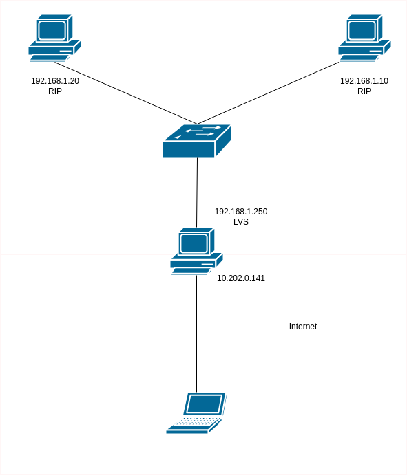
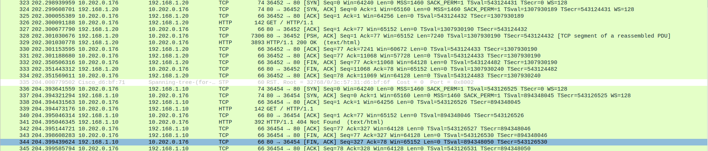

# <center> Equilibrage des charges

## 2. Linux Virtual Server

### 2.1 Réalisation d'une maquette Linux Virtual Server NAT



### 2.2 Caractérisation de LVS NAT

1) 

```sh
dio@lucky-theone:~$ curl 10.202.0.141
<html>
<head><title>404 Not Found</title></head>
<body>
<center><h1>404 Not Found</h1></center>
<hr><center>nginx/1.18.0 (Ubuntu)</center>
</body>
</html>
dio@lucky-theone:~$ curl 10.202.0.141
<!DOCTYPE html PUBLIC "-//W3C//DTD XHTML 1.0 Transitional//EN" "http://www.w3.org/TR/xhtml1/DTD/xhtml1-transitional.dtd">
<html xmlns="http://www.w3.org/1999/xhtml">
  <!--
    Modified from the Debian original for Ubuntu
    Last updated: 2022-03-22
    See: https://launchpad.net/bugs/1966004
  -->
  <head>
    <meta http-equiv="Content-Type" content="text/html; charset=UTF-8" />
    <title>Apache2 Ubuntu Default Page: It works</title>
    <style type="text/css" media="screen">
  * {
    margin: 0px 0px 0px 0px;
    padding: 0px 0px 0px 0px;
  }

  body, html {
    padding: 3px 3px 3px 3px;

    background-color: #D8DBE2;

    font-family: Ubuntu, Verdana, sans-serif;
    font-size: 11pt;
    text-align: center;
  }

  div.main_page {
    position: relative;
    display: table;

    width: 800px;

    margin-bottom: 3px;
    margin-left: auto;
    margin-right: auto;
    padding: 0px 0px 0px 0px;

    border-width: 2px;
    border-color: #212738;
    border-style: solid;

    background-color: #FFFFFF;

    text-align: center;
  }

  div.page_header {
    height: 180px;
    width: 100%;

    background-color: #F5F6F7;
  }

  div.page_header span {
    margin: 15px 0px 0px 50px;

    font-size: 180%;
    font-weight: bold;
  }

  div.page_header img {
    margin: 3px 0px 0px 40px;

    border: 0px 0px 0px;
  }

  div.banner {
    padding: 9px 6px 9px 6px;
    background-color: #E9510E;
    color: #FFFFFF;
    font-weight: bold;
    font-size: 112%;
    text-align: center;
    position: absolute;
    left: 40%;
    bottom: 30px;
    width: 20%;
  }

  div.table_of_contents {
    clear: left;

    min-width: 200px;

    margin: 3px 3px 3px 3px;

    background-color: #FFFFFF;

    text-align: left;
  }

  div.table_of_contents_item {
    clear: left;

    width: 100%;

    margin: 4px 0px 0px 0px;

    background-color: #FFFFFF;

    color: #000000;
    text-align: left;
  }

  div.table_of_contents_item a {
    margin: 6px 0px 0px 6px;
  }

  div.content_section {
    margin: 3px 3px 3px 3px;

    background-color: #FFFFFF;

    text-align: left;
  }

  div.content_section_text {
    padding: 4px 8px 4px 8px;

    color: #000000;
    font-size: 100%;
  }

  div.content_section_text pre {
    margin: 8px 0px 8px 0px;
    padding: 8px 8px 8px 8px;

    border-width: 1px;
    border-style: dotted;
    border-color: #000000;

    background-color: #F5F6F7;

    font-style: italic;
  }

  div.content_section_text p {
    margin-bottom: 6px;
  }

  div.content_section_text ul, div.content_section_text li {
    padding: 4px 8px 4px 16px;
  }

  div.section_header {
    padding: 3px 6px 3px 6px;

    background-color: #8E9CB2;

    color: #FFFFFF;
    font-weight: bold;
    font-size: 112%;
    text-align: center;
  }

  div.section_header_grey {
    background-color: #9F9386;
  }

  .floating_element {
    position: relative;
    float: left;
  }

  div.table_of_contents_item a,
  div.content_section_text a {
    text-decoration: none;
    font-weight: bold;
  }

  div.table_of_contents_item a:link,
  div.table_of_contents_item a:visited,
  div.table_of_contents_item a:active {
    color: #000000;
  }

  div.table_of_contents_item a:hover {
    background-color: #000000;

    color: #FFFFFF;
  }

  div.content_section_text a:link,
  div.content_section_text a:visited,
   div.content_section_text a:active {
    background-color: #DCDFE6;

    color: #000000;
  }

  div.content_section_text a:hover {
    background-color: #000000;

    color: #DCDFE6;
  }

  div.validator {
  }
    </style>
  </head>
  <body>
    <div class="main_page">
      <div class="page_header floating_element">
        
        <div>
          <span style="margin-top: 1.5em;" class="floating_element">
            ENZO EST CE QUE CA A MARCHE, JE CONNAIS PAS LE HTML
          </span>
        </div>
        <div class="banner">
          <div id="about"></div>
          It works!
        </div>

      </div>
      <div class="content_section floating_element">
        <div class="content_section_text">
          <p>
                Est ce que la ça marche ? <br> ouai ça marche lets go, je peux ecrire de la merde dans la page de defaut

		This is the default welcome page used to test the correct 
                operation of the Apache2 server after installation on Ubuntu systems.
                It is based on the equivalent page on Debian, from which the Ubuntu Apache
                packaging is derived.
                If you can read this page, it means that the Apache HTTP server installed at
                this site is working properly. You should <b>replace this file</b> (located at
                <tt>/var/www/html/index.html</tt>) before continuing to operate your HTTP server.
          </p>

          <p>
                If you are a normal user of this web site and don't know what this page is
                about, this probably means that the site is currently unavailable due to
                maintenance.
                If the problem persists, please contact the site's administrator.
          </p>

        </div>
        <div class="section_header">
          <div id="changes"></div>
                Configuration Overview
        </div>
        <div class="content_section_text">
          <p>
                Ubuntu's Apache2 default configuration is different from the
                upstream default configuration, and split into several files optimized for
                interaction with Ubuntu tools. The configuration system is
                <b>fully documented in
                /usr/share/doc/apache2/README.Debian.gz</b>. Refer to this for the full
                documentation. Documentation for the web server itself can be
                found by accessing the <a href="/manual">manual</a> if the <tt>apache2-doc</tt>
                package was installed on this server.
          </p>
          <p>
                The configuration layout for an Apache2 web server installation on Ubuntu systems is as follows:
          </p>
          <pre>
/etc/apache2/
|-- apache2.conf
|       `--  ports.conf
|-- mods-enabled
|       |-- *.load
|       `-- *.conf
|-- conf-enabled
|       `-- *.conf
|-- sites-enabled
|       `-- *.conf
          </pre>
          <ul>
                        <li>
                           <tt>apache2.conf</tt> is the main configuration
                           file. It puts the pieces together by including all remaining configuration
                           files when starting up the web server.
                        </li>

                        <li>
                           <tt>ports.conf</tt> is always included from the
                           main configuration file. It is used to determine the listening ports for
                           incoming connections, and this file can be customized anytime.
                        </li>

                        <li>
                           Configuration files in the <tt>mods-enabled/</tt>,
                           <tt>conf-enabled/</tt> and <tt>sites-enabled/</tt> directories contain
                           particular configuration snippets which manage modules, global configuration
                           fragments, or virtual host configurations, respectively.
                        </li>

                        <li>
                           They are activated by symlinking available
                           configuration files from their respective
                           *-available/ counterparts. These should be managed
                           by using our helpers
                           <tt>
                                a2enmod,
                                a2dismod,
                           </tt>
                           <tt>
                                a2ensite,
                                a2dissite,
                            </tt>
                                and
                           <tt>
                                a2enconf,
                                a2disconf
                           </tt>. See their respective man pages for detailed information.
                        </li>

                        <li>
                           The binary is called apache2 and is managed using systemd, so to
                           start/stop the service use <tt>systemctl start apache2</tt> and
                           <tt>systemctl stop apache2</tt>, and use <tt>systemctl status apache2</tt>
                           and <tt>journalctl -u apache2</tt> to check status.  <tt>system</tt>
                           and <tt>apache2ctl</tt> can also be used for service management if
                           desired.
                           <b>Calling <tt>/usr/bin/apache2</tt> directly will not work</b> with the
                           default configuration.
                        </li>
          </ul>
        </div>

        <div class="section_header">
            <div id="docroot"></div>
                Document Roots
        </div>

        <div class="content_section_text">
            <p>
                By default, Ubuntu does not allow access through the web browser to
                <em>any</em> file outside of those located in <tt>/var/www</tt>,
                <a href="http://httpd.apache.org/docs/2.4/mod/mod_userdir.html" rel="nofollow">public_html</a>
                directories (when enabled) and <tt>/usr/share</tt> (for web
                applications). If your site is using a web document root
                located elsewhere (such as in <tt>/srv</tt>) you may need to whitelist your
                document root directory in <tt>/etc/apache2/apache2.conf</tt>.
            </p>
            <p>
                The default Ubuntu document root is <tt>/var/www/html</tt>. You
                can make your own virtual hosts under /var/www.
            </p>
        </div>

        <div class="section_header">
          <div id="bugs"></div>
                Reporting Problems
        </div>
        <div class="content_section_text">
          <p>
                Please use the <tt>ubuntu-bug</tt> tool to report bugs in the
                Apache2 package with Ubuntu. However, check <a
                href="https://bugs.launchpad.net/ubuntu/+source/apache2"
                rel="nofollow">existing bug reports</a> before reporting a new bug.
          </p>
          <p>
                Please report bugs specific to modules (such as PHP and others)
                to their respective packages, not to the web server itself.
          </p>
        </div>

      </div>
    </div>
    <div class="validator">
    </div>
  </body>
</html>

```

2) 

```sh
root@debian:~# ab -n 100 http://10.202.0.141/
This is ApacheBench, Version 2.3 <$Revision: 1903618 $>
Copyright 1996 Adam Twiss, Zeus Technology Ltd, http://www.zeustech.net/
Licensed to The Apache Software Foundation, http://www.apache.org/

Benchmarking 10.202.0.141 (be patient).....done


Server Software:        Apache/2.4.52
Server Hostname:        10.202.0.141
Server Port:            80

Document Path:          /
Document Length:        10812 bytes

Concurrency Level:      1
Time taken for tests:   0.166 seconds
Complete requests:      100
Failed requests:        5
   (Connect: 0, Receive: 0, Length: 5, Exceptions: 0)
Non-2xx responses:      5
Total transferred:      1054775 bytes
HTML transferred:       1027950 bytes
Requests per second:    601.54 [#/sec] (mean)
Time per request:       1.662 [ms] (mean)
Time per request:       1.662 [ms] (mean, across all concurrent requests)
Transfer rate:          6196.18 [Kbytes/sec] received

Connection Times (ms)
              min  mean[+/-sd] median   max
Connect:        1    1   0.1      1       1
Processing:     1    1   0.2      1       2
Waiting:        1    1   0.1      1       2
Total:          1    2   0.2      2       2

Percentage of the requests served within a certain time (ms)
  50%      2
  66%      2
  75%      2
  80%      2
  90%      2
  95%      2
  98%      2
  99%      2
 100%      2 (longest request)
```

3) 


### 2.3 Réalisation d’une maquette Linux Virtual Server DR

### 2.4 Caractérisation de LVS DR

## 3 Tips and tricks

### 3.1 Configuration du NAT sur un routeur Cisco

### 3.2 Configuration d’une seconde adresse IP sur une interface (DR et NAT)

### 3.3 Configuration d’une seconde adresse IP sur une interface de loopback d’un RIP (DR)

### 3.4 Désactivation de l’arp pour les interfaces RIP des serveurs

### 3.5 Utilisation de iptables pour ne pas configurer de VIP sur les RIPs

## 4 Briques logicielles

### 4.1 Utilisez un client en ligne de commandes :httpie

### 4.2 Manipulation du LVS avec la ligne de commande

### 4.3 Configuration d’un resolver/cache unbound

### 4.4 Pour information : désactivation de l’ICMP redirect au cas en mode "direct routing"

## 5 Toujours plus haut... avec Haproxy un loadbalancer de niveau sept

