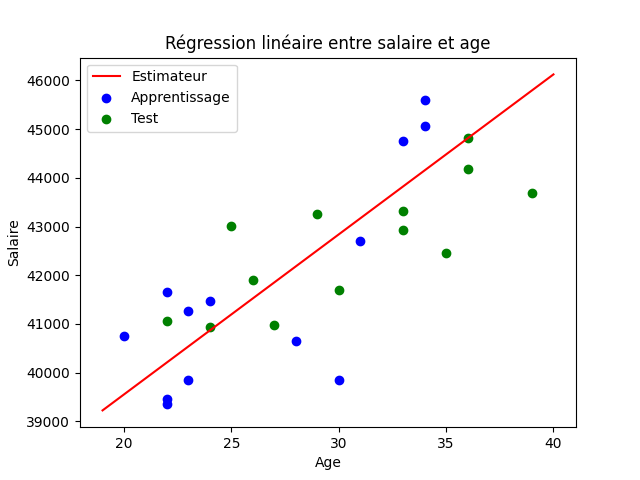
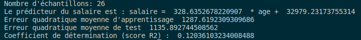

## Mathys DOMERGUE
## RT2 App

## 
 TP1 R420

### 1. Régression linéaire

a) Lors de l'exécution de la fonction, nous devons obtenir le résultat du calcul de l'estiamteur des moindres carrés, mais aussi sa courbe.

Resultat 1:

b)Voici d'autres resultats :

Resultat 2:

Resultat 3:

Resultat 4:

c) Voici les résultat lorsque l'on mets des valleurs aléatoires: 

### 2 Régression polynomiale

