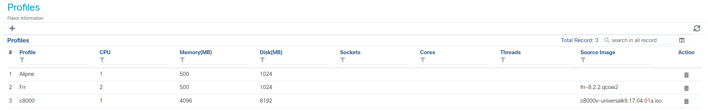

---
Author:
- Mathys Domergue
- Arnaud Pruvost
---


# <center> SAE3D03

## Schéma réseau
  


Juste au-dessus, nous avons le résaeu interne sur GNS3

### Configuration du routeur Cisco 8200v

Notre machine étant déjà à jour nous n'avons pas eu à modifier cela. Mais pour mettre à jour la machine nous allons dans le menu opération pui upgrade :

Pour la configuration du routeur Cisco 8200v, nous avons du utiliser un cable console, avec l'utilitaire Minicom (Linux) ou Terraterme (Windows).

``` bash
sudo apt install minicom
sudo minicom -s
```
Avec la dernière commande nous pouvons configurer Minicom pour préciser notre port série mais aussi la rapidité de modulation, qui dans notre cas est à 9600.

  
  

Pour ensuite ce connecté au routeur, nous sauvegardons la confing au format dfl puis nous sortons de cette configuration.

Lorsque l'on est connecté à la machine nous moddifions l'adresse IP de managment avec les commandes suivantes :

``` mikrotik
nfvis(config)# system settings mgmt ip address 10.202.234.1 255.255.0.0
nfvis(config)# system settings default-gw 10.202.255.254
nfvis(config)# system settings hostname Router
nfvis(config)# commit
nfvis(config)# end
```

Dès lors nous pouvons nous connecter sur le port  GE02 de notre router pour accéder à l'interface graphique de notre machine.

Notre machine étant déjà à jour nous n'avons pas eu à modifier cela. Mais pour mettre à jour la machine nous allons dans le menu opération pui upgrade :


Nous mettons le fichier de mise à jour dans la machine. Pour finir, noous mettons à jour la machine dans cette onglet:


Suite à la mise à jour de la machine, nous avons mis en place un routeur virtuel Cisco 8000. Pour cela, nous nous rendons dans l'onglet configuration puis dans Virtual Machine, Image et Image Repository.
Dans cette onglet nous allons créer un profil pour notre routeur c8000, dans celui-ci nous précisons le nombre de cpus utilisés, la RAM et le Disk mais aussi l'ISO qu'il va utilisé. 



Après nous nous redéplaçons dans Configuration, et nous déployons le routeur.


Il faut bien préciser les interfaces pour le routeur virtuel. 

### Configuration du routeur Cisco 8000

Configuration réseau du Cisco8000, avec le protocol BGP et OSPF pour le routage.

``` c

interface GigabitEthernet1
 ip address 10.202.234.29 255.255.0.0
 negotiation auto
!
interface GigabitEthernet2
 ip address 10.10.1.2 255.255.255.252
 ip ospf network point-to-point
 negotiation auto
!
router ospf 1
 redistribute bgp 69420
 network 10.10.1.0 0.0.0.3 area 0
!
router bgp 69420
 bgp log-neighbor-changes
 redistribute ospf 1
 neighbor 10.202.70.200 remote-as 65700
 neighbor 10.202.200.1 remote-as 10012004
 neighbor 10.202.69.10 remote-as 65420
```
Pour se connecter au routeur, nous avons mis en place le protocole ssh :

``` mikrotik
Router# conf t
Router# aaa new-model
Router# aaa authentication login default local
Router# aaa authorization exec default local
Router# username cisco privilege 15 seret cisco
Router# ip ssh time-out
Router# ip ssh authentication-retries 3
Router# ip scp server enable
```


### Configuration du routeur Mikrotik Chateau Serie 

``` mikrotik
[admin@MikroTik] > export
# jan/19/2024 09:33:37 by RouterOS 7.1.5
# software id = 
#
/interface ethernet
set [ find default-name=ether1 ] disable-running-check=no
set [ find default-name=ether2 ] disable-running-check=no
set [ find default-name=ether3 ] disable-running-check=no
set [ find default-name=ether4 ] disable-running-check=no
set [ find default-name=ether5 ] disable-running-check=no
set [ find default-name=ether6 ] disable-running-check=no
set [ find default-name=ether7 ] disable-running-check=no
set [ find default-name=ether8 ] disable-running-check=no
/disk
set sata1 disabled=no
/interface wireless security-profiles
set [ find default=yes ] supplicant-identity=MikroTik
/ip pool
add name=dhcp_pool0 ranges=172.16.16.1-172.16.16.253
/ip dhcp-server
add address-pool=dhcp_pool0 interface=ether2 name=dhcp1
/port
set 0 name=serial0
/routing ospf instance
add name=ospf-inst router-id=1.2.3.4
/routing ospf area
add instance=ospf-inst name=0
/ip address
add address=10.10.1.1/30 interface=ether1 network=10.10.1.0
add address=172.16.16.254/24 interface=ether2 network=172.16.16.0
/ip dhcp-client
add interface=ether1
/ip dhcp-server network
add address=172.16.16.0/24 dns-server=8.8.8.8 gateway=172.16.16.254
/routing ospf interface-template
add area=0 networks=172.16.16.0/24
add area=0 networks=10.10.1.0/30
add area=0 interfaces=ether1

[admin@MikroTik] > routing ospf lsa print
Flags: S - self-originated, F - flushing, W - wraparound; D - dynamic 
 0  D instance=ospf-inst type="external" originator=10.202.234.29 id=20.202.200.0 sequence=0x80000001 age=1439 checksum=0xFC1 body=
        options=20
        netmask=255.255.255.252
        forwarding-address=10.202.200.1
        metric=1 type-2
        route-tag=10012004

 1 SD instance=ospf-inst area=0 type="router" originator=1.2.3.4 id=1.2.3.4 sequence=0x80000014 age=53 checksum=0x8F92 body=
        bits=
            type=network id=10.10.1.1 data=10.10.1.1 metric=1
            type=stub id=172.16.16.0 data=255.255.255.0 metric=1

 2  D instance=ospf-inst area=0 type="router" originator=10.202.234.29 id=10.202.234.29 sequence=0x80000011 age=61 checksum=0xA697 body=
        bits=E
            type=stub id=10.202.0.0 data=255.255.0.0 metric=1
            type=p2p id=1.2.3.4 data=10.10.1.2 metric=1
            type=stub id=10.10.1.0 data=255.255.255.252 metric=1

 3 SD instance=ospf-inst area=0 type="network" originator=1.2.3.4 id=10.10.1.1 sequence=0x80000001 age=56 checksum=0xE86D body=
        netmask=255.255.255.252
            router-id=1.2.3.4
            router-id=10.202.234.29
```

- En utilisant le routeur Mikrotik, on voit le cisco en tant que neighbor OSPF mais les deux routeurs ne s'echangent pas les routes, on ne peut donc pas sortir du réseau local.

### Configuration FRR

``` c
frr# sh run
Building configuration...

Current configuration:
!
frr version 7.5.1
frr defaults traditional
hostname frr
service integrated-vtysh-config
!
interface eth0
 ip address 10.10.1.1/30
 ip ospf network point-to-point
!
interface eth1
 ip address 172.16.16.254/24
!
router ospf
 ospf router-id 1.2.3.4
 network 10.10.1.0/30 area 0.0.0.0
 network 172.16.16.0/24 area 0.0.0.0
!
line vty
!
end
```