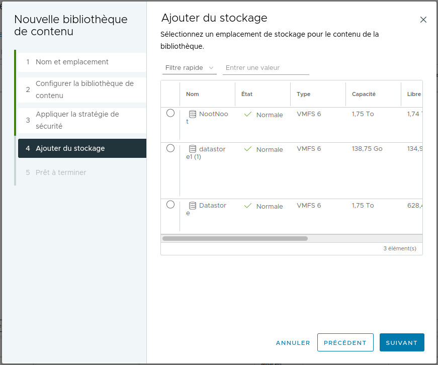

# SAE304

## 
 Virtualisation avec VMware

## 3.Installation de l'infrastructure du TP

## 4.Installation du VMWareVcenter

### 4.1 Installation du Vcenter 7 sur le PC

>**Note** 
> Lors de notre TP nous avons du réaliser de nombreuses réinstallation de notre vcenter donc la configuration peut changer.

### 4.2 Exploration de l'interface graphique du Vcenter 

1) 

2) 

4) 

> **Note**  
> Lors de ce TP, nous avons eu de nombreux soucis au niveau de notre installation, nous avons de ce fait réinstaller 5 fois notre infrastructure pour qu'elle soit fonctionnelle, de plus les serveurs étant mal ventilées, ils se sont mis en sécurité thermique.
