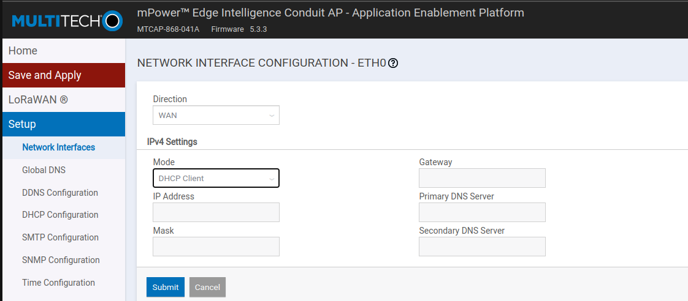
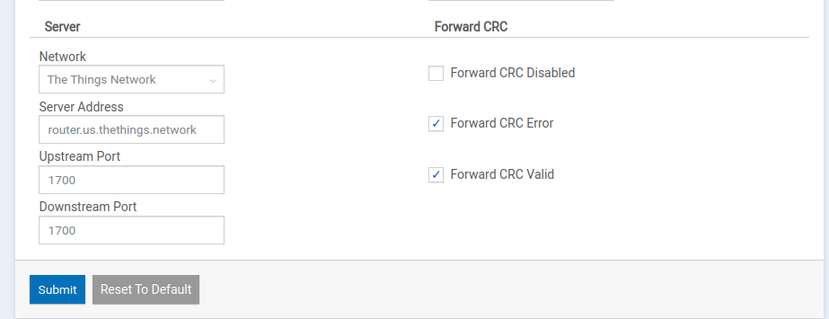

#### CAUBEL Aksel
#### PRUVOST Arnaud
#### DOMERGUE Mathys
## Groupe IOT-51

# 
TP-02

## 
Configuration de la gateway LoraWan

 
 
 

 

 

## Pour mettre en place la gateway :

<a href='https://www.multitech.com/documents/publications/training/S000812--Configuring-mDot-w-MTACP-using-LoRa-App-Note.pdf'>Source Documentation</a>

 
<li> Prendre une IP sur le réseau 192.168.2.x/24, car l'IP par défaut de la Gateway est 192.168.2.1</li>

 

<li> Après avoir créé un utilisateur, dans notre cas l'utilisateur 'root' avec le mot de passe 'IOT51AMA.', suivre la configuration de base qui consiste à configurer les paramétre de base de la gateway tel que l'heure. </li>

 

<li> Une fois la configuration de base fini, aller dans "setup" -> "Network Interfaces" puis modifier "eth0" pour le passer en mode WAN, puis ensuite changer le IPv4 Settings en mode DHCP Client. Une fois la configuration validé il la gateway redémarre, il faut donc utiliser un scanner d'IP pour pouvoir s'y reconnecter avec la nouvelle IP.</li>

 

<li> Il faut maintenant configurer avec quel réseau Lora la Gateway va communiquer, dans notre cas The Things Network, aller dans "LoRaWAN" puis "Network Settings". Dans l'onglet "LoRa Mode" mettre le mode "PACKET FORWARDER" puis en bas de la page dans l'onglet "Server" mettre le serveur voulu, dans notre cas The Things Network, puis mettre la bonne adresse de serveur, dans notre cas "eu1.cloud.thethings.network". Nous avons également modifier le Duty Cycle, on l'a passé en Enable puis nous avons mis une periode de 10 et un ratio de 80.
  Le duty cycle correspond à la durée de temps sur laquel un dispositif peut émettre, il est calculé sur une heure et est exprimer en pourcentage.</li>

 

<li> Il faut ensuite enregistrer la gateway sur <a href='https://www.thethingsnetwork.org/docs/gateways/registration/'>The Things Network</a>. Pour ce faire il faut créé un compte sur TTN ensuite il faut cliquer sur l'icone de son compte, aller dans console choisir le bon serveur (Europe pour nous) puis remplir les informations de la Gateway (Son EUI), les informations se complete automatiquement, il suffit de completer le "frequency plan" avec le "SF9 for RX2".</li>

 

<li>Pour le monitoring de la Gateway, le problème est que pour activer les tunnels, il faut activer des ports où nous n'avons pas le droit de les activer car se sont des ports pour le VPN.</li>

 

<li> Pour le parfeu, nous avons essayer de le faire nous y sommes pas arrivés, mais nous avons compris le principe.</li> 