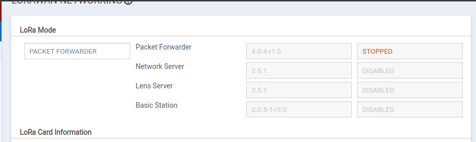
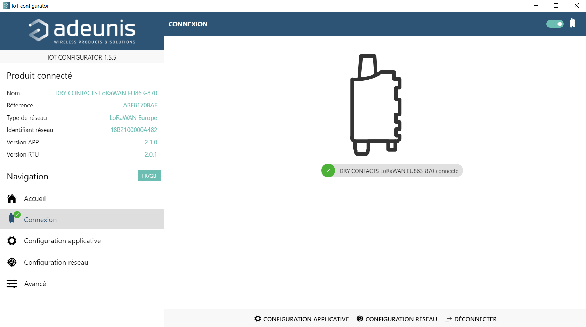
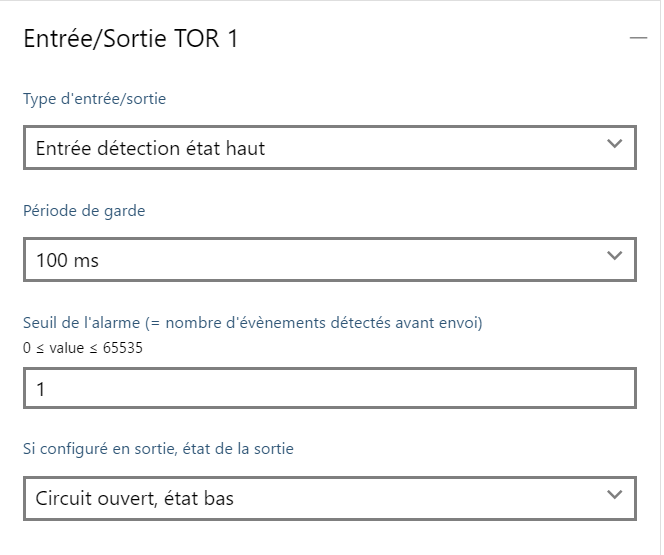

<link rel="stylesheet" href="style.css">

<style>

.red {
    color:red;
}

</style>

<a href="#-script-de-collection-donnée-LoRa-TTN"> Allez directement à la documentation Windows</a>


#### CAUBEL Aksel

#### PRUVOST Arnaud

#### DOMERGUE Mathys

## Groupe IOT-51

</br>

<h1 class='red'><center>Compte Rendu Partie Technique</center></h1>

</br>
</br>

# Sommaire :
## <li> Gateway </li>
## <li> Configuration des capteurs </li>
### Généralité
### Sens'it 3 Sigfox
### Elsys ERS2
### RF-Track NFC reader
### Adeunis Dry contact
## <li> Installation et configuration de InfluxDB </li>
## <li> Installation et configuration de Grafana </li>
## <li> Système d'Alerte </li>
## <li> Récupération donnée Sigfox </li>
## <li> Récupération donnée TTN </li>
## <li> Annexe </li>
</br>
</br>
</br>
</br>

# Configuration de la Gateway Lora et des differents capteurs

</br>

<a href='https://www.multitech.com/documents/publications/training/S000812--Configuring-mDot-w-MTACP-using-LoRa-App-Note.pdf'>Source Documentation</a>

Pour configurer la Gateway Lora :
<br>
<li> Prendre une IP sur le réseau 192.168.2.x/24, car l'IP par défaut de la Gateway est 192.168.2.1</li>

<br>

<li> Suivre la configuration de base après avoir créé un utilisateur, dans notre cas l'utilisateur 'root' avec le mot de passe 'IOT51AMA.'</li>


<br>

<li> Une fois la configuration de base fini, aller dans "setup" -> "Network Interfaces" puis modifier "eth0" pour le passer en mode WAN, puis ensuite changer le IPv4 Settings en mode DHCP Client. Une fois la configuration validé il la gateway redémarre, il faut donc utiliser un scanner d'IP pour pouvoir s'y reconnecter avec la nouvelle IP.</li>


<br>

<li> Il faut maintenant configurer avec quel réseau Lora la Gateway va communiquer, dans notre cas The Things Network, aller dans "LoRaWAN" puis "Network Settings". Dans l'onglet "LoRa Mode" mettre le mode "PACKET FORWARDER" puis en bas de la page dans l'onglet "Server" mettre le serveur voulu, dans notre cas The Things Network, puis mettre la bonne adresse de serveur, dans notre cas "eu1.cloud.thethings.network". Nous avons également modifier le Duty Cycle, on l'a passé en Enable puis nous avons mis une periode de 10 et un ratio de 80.
<br> Le duty cycle correspond à la durée de temps sur laquel un dispositif peut émettre, il est calculé sur une heure et est exprimer en pourcentage.</li>



<br>

<li> Il faut ensuite enregistrer la gateway sur <a href='https://www.thethingsnetwork.org/docs/gateways/registration/'>The Things Network</a>. Pour ce faire il faut créé un compte sur TTN ensuite il faut cliquer sur l'icone de son compte, aller dans console choisir le bon serveur (Europe pour nous) puis remplir les informations de la Gateway (Son EUI), les informations se complete automatiquement, il suffit de completer le "frequency plan" avec le "SF9 for RX2".</li>

<br>

# Pour les capteurs sur le réseau LoRa

Dans le cas des capteurs se connectant a un réseau LoRa (TTN dans notre cas) il faut au préalable les enregistrer sur le réseau en question, pour ce faire il remplir les informations du capteur ou actionneur à savoir :

- Sa devEUI (ID unique de chaque device) : équivalent d'une adresse MAC.

- Son appEUI : même chose que le JoinEUI, ils permettent de se connecter au réseau.
- Son appKey : clé de cryptage de la communication entre le capteur et l'Application Server.

<br>

# Capteur Sens'it de Sigfox

Le capteur Sigfox étant déjà activé on peut passer au choix de mode du capteur. Pour cela, il faut réaliser un appui long sur le bouton central la couleur du bouton centrale varie en fonction du mode, les differents modes sont :

- Temperature et humidité (couleur verte)
- capteur de luminosité (couleur jaune)
- Détecteur d'ouvertur de porte (couleur blue claire)
- Capteur de vibration (couleur bleu foncé)
- Capteur magnétique (couleur rose)

Il existe aussi un mode standby dans lequel le capteur est en veille.

Ce capteur n'étant pas connecter au réseau LoRa nous n'avons pas à l'enregistrer sur TTN, donc pour récupérer les informations transmise par le capteur il a fallu développer unscript python(voir anexe).

<br>

# Capteur Elsys ERS2 (Mouvement, température, humidité et luminosité)

<li> Pour pouvoir mettre en place le capteur ERS2 il faut premièrement insérer 2 piles, cela va mettre en route le capteur. <br>
Lorsque cela est fait il faut utiliser l'application "Sensor settings" de Elsys qui va nous permettre de configurer le capteur. <br>
Dans l'application, il faut aller dans "Advanced mode" puis sélectionner le capteur qui nous interesse (dans notre cas ERS) puis le "Timebase" permet de regler le délai entre chaque transmission du capteur, dans notre cas 100 secondes donc le capteur nous retourne ses information toutes les 1 minute 40.
Puis on modifie dans "Extended LoRaWan configuration" la "Link period" et le Link threshold, la periode à 100 et le threshold à 4. La valeur du threshold correspond à un certain nombre de packet perdu si cette valeur est atteinte alors on attend la valeur du "link period" avant de renvoyer des paquets.

On peut ensuite récupérer la "AppKey" qui va nous permettre de renseigner le capteur sur TTN ce qui nous permet de centralisé nos données avant de les envoyé dans notre base de données.</li>

<br>

# RF-Track NFC Reader

<li>
Pour pouvoir mettre en place le lecteur NFC il faut en premier temps se munir d'un aimant puis le faire passer devant le lecteur pour le mettre dans le mode de fonctionnement voulu :

- Pour mettre le lecteur en mode "JOIN" pour rejoindre un réseau LoRa : 4 passages avec l'aimant dans un intervalle de 5 secondes, la LED du lecteur clignotera en bleu.
- Pour désactiver le lecteur : 5 passages de l'aimant dans un intervale de 5 secondes, la LED va s'allumer en bleu pendant une seconde puis va s'eteindre.
- Pour activer le lecteur : 1 passages avec l'aimant, puis la LED va clignoter une fois en vert.
- Quand un badge valide est passé : la LED va clignoter une fois en vert avec un BIP.
- Quand un badge est capté mais que son ID n'est pas reconue : la LED clignote une fois en rouge

Le capteur nous renvoie des informations en Hexadecimal qui sont transformer en base 64 par TTN, Aksel à donc développer unscript python pour passer de la base 64 en héxadécimal puis pour passer de l'héxadécimal en binaire. Voir annexe fin du compte rendu.

</li>

<br>

# Adeunis Actionneur DRY CONTACT LoRa

<br>

<a href='https://adeunis.notion.site/Guide-Utilisateur-DRY-CONTACS-IP68-LoRaWAN-EU863-870-cc7a09682783479c8292a47d85b6b88b'>doc adeunis</a>

<li>Pour l'actionneur DRY CONTACT, il faut en premier le sortir de sa veille pour cela il suffit de passé un aimant pendant une durée suppérieur à 5 secondes, une LED verte s'allume puis se mets à clignoter rapidement pendant la phase de démarrage.<br>
Il faut ensuite passer en mode COMMANDE pour pouvoir faire les configurations de l'actionneur, pour ce faire il faut télécharger l'application "IOT CONFIGURATOR" de adeunis et se brancher sur le port USB de l'actionneur. Lorque le cable USB est débrancher l'actionneur passe dans le mode PRODUCTION.
</li>








<br>

<li>
Pour se connecter à un réseau LoRa l'actionneur doit faire une requêtre JOIN, il en effectue une à chaque passage d'un aimant ou lors de la sortie du mode commande.
</li>

<br>

# Décodage payload

<br>

Pour pouvoir décoder les differents Payload des capteurs de marque Elsys (a savoir le capteur de mouvement, de temperature, d'humidité, luxmètre et tension de la batterie) il suffit sur The Things Network d'aller sur son application puis dans son capteur, puis dans "payload formatters" puis dans la catégorie Uplink il faut passer en "custom javascript formatter" et ensuite copier le code en JavaScript fournie par Elsys.
<br>
Ce code permet de décoder les payloads qui sont par défaut 'crypter' pour avoir les informations des capteur en clair.

<br>

<a href='https://www.elsys.se/en/ttn-guide/'>Elsys & TTN</a>

<br>
<br>


<br>

# Installation des packages InfluxDB

<br>

Premièrement, installation des package :

```bash
wget -q https://repos.influxdata.com/influxdb.key
echo'23a1c8836f0afc5ed24e0486339d7cc8f6790b83886c4c96995b88a061c5bb5d influxdb.key' | sha256sum -c && cat influxdb.key | gpg --dearmor | sudo tee /etc/apt/trusted.gpg.d/influxdb.gpg > /dev/null

echo 'deb [signed-by=/etc/apt/trusted.gpg.d/influxdb.gpg] https://repos.influxdata.com/debian stable main' | sudo tee /etc/apt/sources.list.d/influxdata.list

sudo apt install influxdb2

sudo systemctl start influxdb
```

Ensuite création des Utilisateurs de la base de données.

```bash
root@scw-nervous-keller:~# influx setup
> Welcome to InfluxDB 2.0!
? Please type your primary username admin
? Please type your password ********
? Please type your password again ********
? Please type your primary organization name iutbeziers
? Please type your primary bucket name telegraf
? Please type your retention period in hours, or 0 for infinite 0
? Setup with these parameters?
  Username:          admin
  Organization:      iutbeziers
  Bucket:            telegraf
  Retention Period:  infinite
 Yes
User Organization Bucket
admin iutbeziers telegraf
```

On peut ensuite aller sur la version graphique de la base de données via le lien : <a href="http://51.158.110.29:8086/">InfluxDB-iot51</a>.

Il faut se connecter en utilisant les identifiants prècedement créé.
<br>


# Installation du package Grafana

<br>

``` bash
sudo apt update && sudo apt -y full-upgrade
[ -f /var/run/reboot-required ] && sudo reboot -f
sudo apt install -y gnupg2 curl software-properties-common
curl -fsSL https://packages.grafana.com/gpg.key | sudo gpg -dearmor -o /etc/apt/trusted.gpg.d/grafana.gpg
sudo add-apt-repository "deb https://packages.grafana.com/oss/deb stable main"
sudo apt -y install grafana
```

<br>

Il faut ensuite démarrer le serveur :

```bash
sudo systemctl start grafana-server
```

Pour ce connecter au Grafana : <a href="http://51.158.110.29:3000/">Grafana-iot51</a>

Identifiant : Pujas.Philippe<br>
Mot de passe : Cequetuveuxmaistumeledonnes
g
# Configuration de Grafana :   aksel


# Système d'alerte mail

Comme attendu dans le cahier des charges, une alerte par mail a été crée pour la température. entre 15°c et 21°c la température est bonne cette dernière ne génèrera alors pas d'erreur mais si la température est plus hautes / plus faible que cette plage donnée, un email est alors envoyé. 
<pre>
Bonjour,
                                
Ce message survient a une alerte dans votre poulailler.
                                       
    Ci-dessous les relever du poulailler : 
                                                    
        Température : {temp} °c
        Humidité : {hum} %
        {"PRESENCE AUTOUR DE L'ENCLO" if presence else "aucune présence détectée"}

</pre>

Une fois que l'alerte est passé ( température revenu a la normale ) le mode alerte est réamorcé et un mail indiquant le retour a la normale :

<pre>
Bonjour,
                                
Les constantes du poulailler sont à nouveaux correcte !
                                       
    Ci-dessous les relever pouvant être a l'origine : 
                                                    
        Température : {temp} °c
        Humidité : {hum} %
        {"PRESENCE AUTOUR DE L'ENCLO" if presence else "aucune présence détectée"}
        
Un mail vous sera envoyé lorsque les constantes reviendront a la normale

</pre>


Pour le fonctionnement des mails, nous sommes passé par un compte Gmail crée pour l'occasion. A partir de ce mail on génére dans nos paramètres de sécurité un "token d'application"

# ANNEXE

## script de collection donnée LoRa TTN

```py
import paho.mqtt.client as mqtt
from time import sleep
import json
from influxdb_client import InfluxDBClient, Point
from influxdb_client.client.write_api import SYNCHRONOUS
import base64

ttnLogin:list[tuple,...] = [ # (UserId,ttnToken)
    ("iutbiot51@ttn","NNSXS.3BVJF3YWR6MKUSJUGRYSI4K665V3TVYZZD6CK7Y.PTPMIRWO4ORECVZLDRJOIOAU4EXQ4JTVC3QYTDZ7CUBH6YK6BR3Q"),
    ("iotapplication@ttn","NNSXS.E6CNY5PDHM4MZXGFCFFTAQV6ZMIVHBNRJM7KSJI.5V2VVNHW6MUAZNTCSO27WBLHE34Y6IVRLIGGTZF4WZG4TDHDQEDQ"),
    ("sae304-test-sensors@ttn","NNSXS.CRRMZSLD77FVBPH56YD6US7UGW3J7HSXPAZORRY.WOJ3P3VJCADEW3MQO64FEBABOLBIHDMIWFOELWN5P4GVBT5V2HIA")
    ]


def on_message(client, userdata, message):
    """Fonction appelé lors de l'arriver """
            
    jsonData = json.loads(message.payload.decode('utf-8')) # Charge le payload sous forme JSON 
    
    
    bucket = "IUT_Devices" # bucket Influx
    token = "NZuKx9nuCgkreX6PJ7jd2IdEGNVAosqmxcJUnJi944WTODCL-XJ1WXcAEHcMwmpEbML20G4P60QEr99YiU-xcg==" # Token Ecriture IUT_Devices
    
    client = InfluxDBClient(url="http://51.158.110.29:8086", token=token, org="iutbeziers") # Login to Influx
    write_api = client.write_api(write_options=SYNCHRONOUS) # Write mode + synchronise
    
    device = jsonData["end_device_ids"]["dev_eui"]
    
    if device == "A81758FFFE086F8D" or device == "A81758FFFE086F90" or device == "A81758FFFE086F91" : # Capteur de mouvement poulailler 1 | 1 | 2
        
        hum,light,motion,temperature,vdd = jsonData.get('uplink_message').get('decoded_payload').values() # récupère les différentes valeurs
        
        # Init des différents relever
        h = Point("sensors").tag("device",device).field("hum",float(hum))
        l = Point("sensors").tag("device",device).field("lux",light)
        m = Point("sensors").tag("device",device).field("motion",motion)
        t = Point("sensors").tag("device",device).field("temp",float(temperature))
        v = Point("sensors").tag("device",device).field("vdd",vdd/1000)
        
        # Ecriture des différents relever dans InfluxDB
        write_api.write(bucket=bucket, record=h)
        write_api.write(bucket=bucket, record=l)
        write_api.write(bucket=bucket, record=m)
        write_api.write(bucket=bucket, record=t)
        write_api.write(bucket=bucket, record=v)
    
        print(f"{device} print data")
    
    elif device == "70B3D5E820002D69" : # Pour Lecteur RFID
        
        rawPayload = jsonData.get('uplink_message').get('frm_payload') # récupère le payload
        hexPayload = base64.b64decode(rawPayload).hex() # converti la Base 64 en Hexa
        
        if hexPayload.startswith("4e"): # Si le payload commence par 4e il contient un ID
            #test = "4e606c5ff5070430bdaa204e80606c600a070430bdaa204e80"
            lenId = hexPayload[10:12]
            ID = hexPayload[12:12+(int(lenId))*2]
            
            num_of_bits = int(lenId)*8

            binData = bin(int(ID, 16))[2:].zfill(num_of_bits) # converti l'hexa en bin
            ID = int(binData,2) # converti en decimal
            
            i = Point("sensors").tag("device",device).field("id",ID) # préparation InfluxDB
            write_api.write(bucket=bucket, record=i) # écrit dans la base de donnée
            
    
    client.close() # Close the Influx connexion
    


brokerIp = "eu1.cloud.thethings.network" # Need to be a String
brokerPort = 1883  # Need to be a Int

listener:dict = {} # Stockage des différents écouters MQTT dans un dictionnaire

""" Pour toutes les applications ttn : """

for userId, ttnToken in ttnLogin:
    topic = f"v3/{userId}/devices/+/up"


    listener[userId] = mqtt.Client()
    listener[userId].username_pw_set(userId, password=ttnToken) # Set se login to the MQTT-Broker
    listener[userId].connect(brokerIp,brokerPort,60)
    listener[userId]._send_connect = print(f"listener {userId} : trying to connect...") # SIN
    listener[userId].on_connect = print(f"listener {userId} : Connected on {brokerIp}:{brokerPort}") # SIN ACK
    listener[userId].on_message = on_message # exec on_message when a message arrive
    listener[userId].subscribe(topic) # listen on the topic
    listener[userId].loop_start() # listen begin | Use a thread
    print("\n\n")

print("All listenner are ok !")

print("\n")


""" Création d'une boucle infinie pour que les écoutes ne s'arrête pas """
while True:
    sleep(5000)
    
```

## script python pour sigfox

```py
import requests
import json
from influxdb_client import InfluxDBClient, Point
from influxdb_client.client.write_api import SYNCHRONOUS
from time import sleep

devices = ["B448E4","B44037","B44949"] # Liste des capteurs Sigfox
login = "6334446bbdcbd20e4daf92b4" 
password = "3806e9d6cead4f45803df27eee00994a"
authentication = (login, password) # creds pour Sigfox


while True: # toute les 10mins
    
    for device in devices:


        response = requests.get(f"https://backend.sigfox.com/api/v2/devices/{device}/messages",
        auth=authentication) # questionne l'API REST Sigfox

        jsonData = json.loads(response.text) # transforme le Str en JSON
        lastData = jsonData["data"][0] #prend la dernière valeurs


        my_hexdata = lastData['data'] # extrait le payload ( Hexa )


        scale = 16 ## nb caractère

        num_of_bits = len(my_hexdata)*4

        binData = bin(int(my_hexdata, scale))[2:].zfill(num_of_bits) # hexa -> bin 


        """ Parcing payload avec information Sigfox """
        
        batterie = (int(binData[:5],2)* 0.05) + 2.7

        reserved = binData[5:8]
        dataType = binData[8:13]

        flag = binData[13:14]

        dataTmp = (int(binData[14:24],2)-200)/8

        dataHum = int(binData[24:32],2)/2
        

        bucket = "IUT_Devices" # Bucket influxDB
        token = "NZuKx9nuCgkreX6PJ7jd2IdEGNVAosqmxcJUnJi944WTODCL-XJ1WXcAEHcMwmpEbML20G4P60QEr99YiU-xcg==" # Token Bucket


        client = InfluxDBClient(url="http://51.158.110.29:8086", token=token, org="iutbeziers") # Login to Influx
        write_api = client.write_api(write_options=SYNCHRONOUS) # Write mode + synchronise

        t = Point("sensors").tag("device",device).field("temp",dataTmp) # create the influx point
        h = Point("sensors").tag("device",device).field("hum",dataHum) # create the influx point
        v = Point("sensors").tag("device",device).field("vdd",batterie)

        write_api.write(bucket=bucket, record=t) # write
        write_api.write(bucket=bucket, record=h) # write
        write_api.write(bucket=bucket, record=v) # write

        print(f"Data push : tmp = {dataTmp} | hum = {dataHum}")
        client.close() # ferme la connexion client

    

    sleep(60*10) # dors 10mins
  ```
