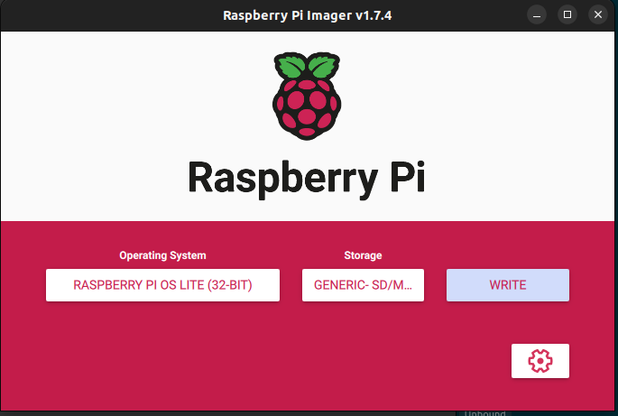
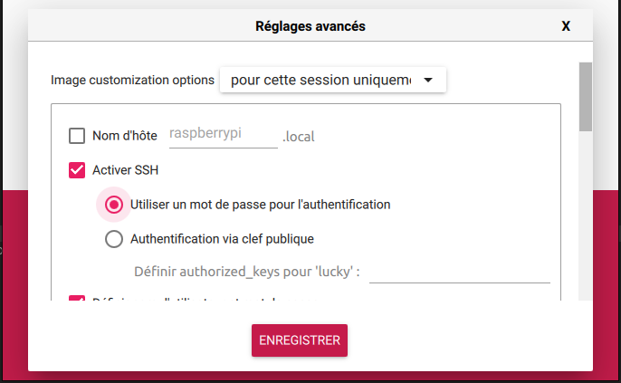
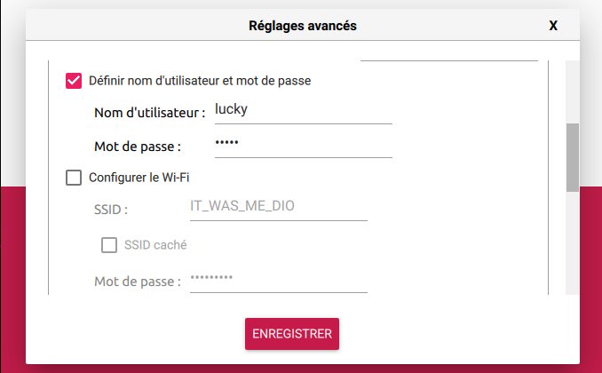
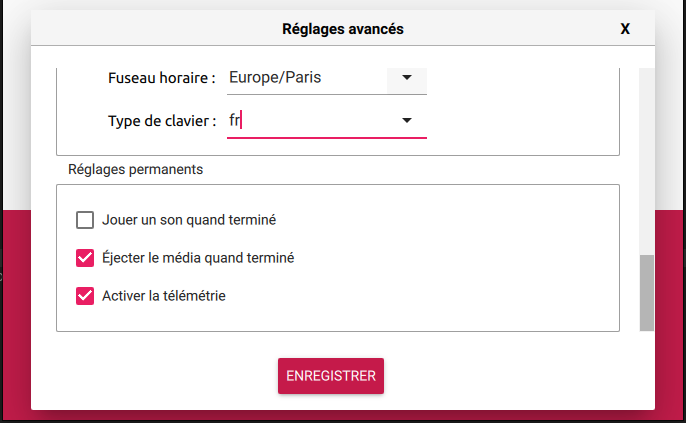
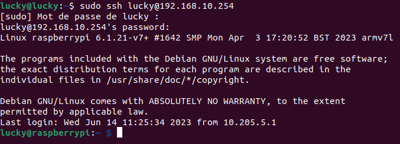

## Mathys Domergue
## RT2 App

# <center> SAE401 Configuration du Raspberry-Pi


## Insatllation de RaspberryPi

Pour réinsaller un raspberry pi de zéro, il faut :


- Il faut utiliser raspberry-pi imager, ceci est l'installeur pour avoir un OS sur le raberry-pi.
- Pour faciliter la suite de notre installation nous allons prendre une version lite de l'OS de RPI, ceci nous enleve l'interface graphique est pouvoir faire tous en ligne de commandes.


- Dans les paramètres nous allons activer le ssh pour pouvoir se connecter à notre machine, définir un utilisatuer et un mot de passe.





- Dès lors que vous avez configurer les paramètres précédents, vous pouvez configurer le fichier "dhcpcd.conf". Dans ce fichier, nous allons préciser que l'adresse IP statique va prendre notre RPI.

``` c#
interface eth0
static ip_address=10.205.5.2/16
static routers=10.205.255.254
static domain_name_servers=10.255.255.200 8.8.8.8 fd51:42f8:caae:d92e::1

```


  - Maintenat nous pouvons maintenant nous connecter à notre RPI

 


</n>
</n>
</n>
</n>
</n>
</n>
</n>
---------------------------------------------------------------------------------------------------------------------------------------------------------------------


## Configuration du point Wifi

Pour réaliser le point Wifi, il va falloir réaliser dans un premier temps, activer l'adresse IP de notre carte Wifi :

```c#
interface wlan0
static ip_address=192.168.10.254/24
static routeurs=10.205.5.2
static domaine-name-servers=10.205.5.2 8.8.8.8

```


Ensuite, on instale le paquet "hostapd" avec la commande :

```c"
sudo apt-get -y install hostapd
```

Le paquet installé, on va créer un fichier "hostapd.conf":

```c#
# interface wlan du Wi-Fi
interface=wlan0

# nl80211 avec tous les drivers Linux mac80211 
driver=nl80211

# Nom du spot Wi-Fi
ssid=IT_WAS_ME_DIO

# mode Wi-Fi (a = IEEE 802.11a, b = IEEE 802.11b, g = IEEE 802.11g)
hw_mode=g

# canal de fr      quence Wi-Fi (1-14)
channel=6

# Wifi prive avec authentification
auth_algs=1

# Beacon interval in kus (1.024 ms)
beacon_int=100

# DTIM (delivery trafic information message) 
dtim_period=2

# Maximum number of stations allowed in station table
max_num_sta=255

# RTS/CTS threshold; 2347 = disabled (default)
rts_threshold=2347

# Fragmentation threshold; 2346 = disabled (default)
fragm_threshold=2346

# mode Wi-Fi 
hw_mode=g
channel=6


wpa=2
#wpa_psk=0123456789abcdef0123456789abcdef0123456789abcdef0123456789abcdef
wpa_passphrase=konodioda
wpa_key_mgmt=WPA-PSK
wpa_pairwise=CCMP
rsn_pairwise=CCMP


```

Dans ce fichier vous allez préciser le SSID, le mot de passe, la fréquence d'émission.

Pour que votre service hostapd puisse se lancer dès lors que vous lancer votre RPI, utiliser la commande suivante:

```c#
sudo systemctl unmasked hostapd
sudo systemctl enable hostapd
```

## Configuration du serveur DHCP


Pour mettre en place un serveur DHCP il faut installer paquet "isc-dhcp-server".

```c#
sudo apt install isc-dhcp-server
```

Ensuite, on va modifier le fichier dhcpcd.conf, pour y acceder on fait la commande:

```
sudo nano /etc/dhcp/dhcpd.conf
```

On ajoute ensuite les lignes suivantes qui permettent de definir notre serveur dhcp :


```fortran
option domain-name-servers 192.168.10.254;

default-lease-time 600;
max-lease-time 7200;

authoritative;

log-facility local7;


subnet 192.168.10.0 netmask 255.255.255.0 {
     #option domain-name "wifi.localhost";
     option routers 192.168.10.254;
     option subnet-mask 255.255.255.0;
     option broadcast-address 192.168.10.255;
     option domain-name-servers 192.168.10.254;
     range dynamic-bootp 192.168.10.15 192.168.10.100;
     host client1 {
        hardware ethernet 24:0A:C4:1D:46:94;
        fixed-address 192.168.10.200;
     }
}


```

On précise une adresse fixe pour notre esp32 plus tard.

## Configuration du Firewall

Pour pouvoir configurer le firewall, il faut activer dans le fichier "sysctl.con", la ligne suivante :

``` c#
net.ipv4.ip_forward=1
```


Puis voici les regles utiliser dans notre RPI :

```c#
sudo iptables -t nat -A POSTROUTING -o eth0 -j MASQUERADE
sudo iptables -A FORWARD -i eth0 -o wlan0 -m state --state RELATED,ESTABLISHED -j ACCEPT
sudo iptables -A FORWARD -i wlan0 -o eth0 -j ACCEPT
```

## Configuration du DNS

Pour le DNS en doubles vues, nous allons utilisé le paquet bind9, celui ci s'installe avec la commande suivante:


```c#
sudo apt install bind9
```


Pour réaliser, la résolution de notre esp32 nous allons créer deux fichiers de configuration un pour la partie wifi et un pour la partie ethernet.

```c#
sudo nano /etc/bind/db.sae401.wifi
```

Dans ce fichier, on va mettre :

```c#
$TTL 1d
@     IN    SOA   ns2.sae401.bz. admin.sae401.bz. (
                  2023061301  ; Serial
                  1d          ; Refresh
                  2h          ; Retry
                  1w          ; Expire
                  1d )        ; Minimum TTL
;
@     IN    NS    rt.sae401.bz.
@     IN    A     192.168.10.200
```
Puis la partie ethernet:

```c#
sudo nano /etc/bind/db.sae401.ethernet
```
```c#            
$TTL 1d
@     IN    SOA   ns1.sae401.bz. admin.sae401.bz. (
                  2023061301  ; Serial
                  1d          ; Refresh
                  2h          ; Retry
                  1w          ; Expire
                  1d )        ; Minimum TTL
;
@     IN    NS    rt.sae401.bz.
@     IN    A     10.205.5.2
```
Une fois que les deux fichier sont créer et modifier nous pouvons mettre en place notre serveur en modifiant le fichier "/etc/bind/named.conf.default-zones"


Voici le fichier de configuration : 

```c#
acl loc {127.0.0.0/8;};

view local {

        match-clients {loc;};
// prime the server with knowledge of the root servers
        zone "." {
                type hint;
                file "/usr/share/dns/root.hints";
        };

// be authoritative for the localhost forward and reverse zones, and for
// broadcast zones as per RFC 1912

        zone "localhost" {
                type master;
                file "/etc/bind/db.local";
        };

        zone "127.in-addr.arpa" {
                type master;
                file "/etc/bind/db.127";
        };

        zone "0.in-addr.arpa" {
                type master;
                file "/etc/bind/db.0";
        };

        zone "255.in-addr.arpa" {
                type master;
                file "/etc/bind/db.255";
        };


};

// Definition des listes d'accés
acl interne { 192.168.10.0/24;};
acl externe { 10.205.0.0/16;};

// Autorisation pour le wifi
view access_wifi {

        match-clients { interne;};

        zone "rt.sae401.bz"{
                type master;
                file "/etc/bind/db.sae401.wifi";
        };
};


// Autorisation pour ethernet
view access_ethernet {

        match-clients { externe;};

        zone "rt.sae401.bz"{
                type master;
                file "/etc/bind/db.sae401.ethernet";

        };
};


```